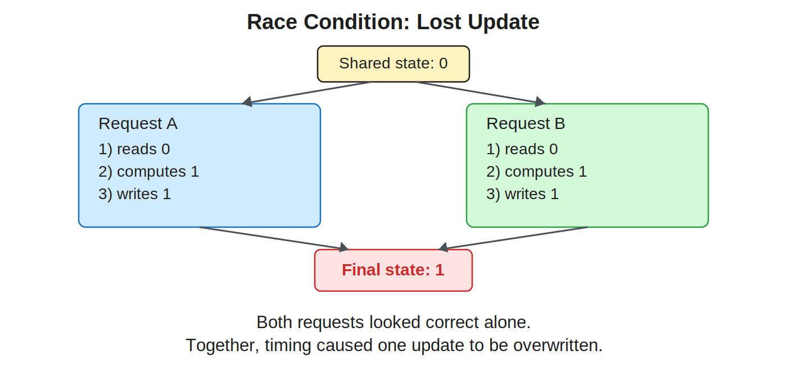

# 09 Persistence

This is the primary reading for Lecture 6.9 in COMPSCI 326 Web Programming. In this chapter, you will learn what persistence really means, why it is more than “saving to a file,” and how to design Node/TypeScript systems that preserve correctness when [processes](./a-glossary) restart, requests overlap, and failures happen at inconvenient times.

By the end of this reading, you should be able to do three things confidently. First, you should be able to explain the persistence mental model clearly enough for an exam. Second, you should be able to read and reason about the lecture code examples line by line. Third, you should be able to create and run these examples locally and use them as a starting point for your own app design.

If you remember one sentence from this chapter, remember this: persistence is a boundary around canonical state, and that boundary must hold under restart, failure, and concurrency.

## 1. Starting from the Problem We Actually Have

Programs end. Node [processes](./a-glossary) crash. laptops sleep, reboot, and lose in-memory state. Yet users expect that when they come back tomorrow, their entries, carts, projects, and settings are still there.

That gap between runtime behavior and user expectation is exactly why persistence exists. Persistence is not a “nice extra”; it is a core requirement for almost every real application.

In this course sequence, the persistence lecture is intentionally split into two parts. Lecture 6.9 builds the theory and architecture discipline. Lecture 6.10 applies that discipline with Prisma. This chapter is focused on 6.9: conceptual foundations plus small Node/TypeScript examples that make those foundations concrete.

## 2. The Central Mental Model: Canonical State and Boundaries

A useful persistence model starts with one question: what state is canonical?

Canonical state is the data your application treats as authoritative truth. If this state disappears or becomes inconsistent, your application is functionally broken. Everything else is derivative, cache-like, or recomputable.

For example, in a journal app, an entry’s title and body are canonical. A UI sort order can be recomputed. In a cart app, quantities and line items are canonical. A temporary “hovered row” visual state is not.

Once you identify canonical state, persistence becomes a boundary problem. You need a well-defined place in your architecture where canonical state crosses from volatile runtime memory into durable storage. You also need to enforce invariants at this boundary.

This is why the lecture emphasizes repository interfaces. A repository gives persistence a stable architectural boundary instead of scattering filesystem/database calls throughout route handlers.

## 3. What “Persistent” Means Precisely

In everyday conversation, students use “persistent” to mean “stored somewhere.” For software design, that definition is too loose.

A stronger definition is this:

> data is persistent if it survives [process](./a-glossary) restart and can be retrieved in a later execution.

In many systems, we also require data to survive machine restart and power loss. That leads to the durability concept from transaction theory: once a write is considered committed, it should remain even after failure.

This is also where vocabulary matters on exams:

- **Volatile state:** disappears when [process](./a-glossary) or machine state resets (e.g., in-memory objects).
- **Persistent state:** survives runtime boundaries.
- **Durable write:** a write intended to remain after crash/restart.
- **Invariant:** a rule that must remain true after every write.

## 4. Data Lifetime Categories

Not all state deserves equal persistence effort. A practical way to reason about design decisions is to classify data by lifetime.

Request-lifetime state exists only while handling one HTTP request. Session-lifetime state may span multiple requests for one user. Application-lifetime state survives across requests while the [process](./a-glossary) stays alive, but disappears when the [process](./a-glossary) exits. Long-lived state survives those boundaries and is the main target of persistence.

This classification helps prevent two opposite mistakes: over-engineering temporary state into durable storage, and under-engineering critical state as “just a runtime variable.”

## 5. Storage Hierarchy and Why It Matters

The lecture’s storage hierarchy is a mental model, not a hardware class. But it is useful:

- CPU/cache/RAM are fast but volatile.
- Disk/SSD is slower but persistent.
- Remote database storage adds network hops and shared access.


You do not need exact latency numbers to use this model correctly. You only need to internalize the tradeoff: volatility is fast but fragile; durability is slower but reliable. Good system design chooses where each kind of state should live.

## 6. Example 00: Runtime vs Persistent State

The first lecture example shows the core difference with very little code.

File: `examples/00-runtime-vs-persistent/src/inMemoryCounter.ts`

```ts
let count = 0

export function increment(): number {
  count += 1
  return count
}

export function getCount(): number {
  return count
}
```

This module-level `count` value persists only while the [process](./a-glossary) is alive. If the server restarts, the value resets to zero. That is not a bug in TypeScript or Node; it is exactly how memory works.

The paired file-based helper adds persistence behavior.

File: `examples/00-runtime-vs-persistent/src/fileStore.ts`

```ts
import { promises as fs } from 'node:fs'

export async function writeJsonAtomic<T>(
  filePath: string,
  data: T,
): Promise<void> {
  const tempPath = `${filePath}.tmp`
  await fs.writeFile(tempPath, JSON.stringify(data), 'utf8')
  await fs.rename(tempPath, filePath)
}

export async function readJson<T>(filePath: string): Promise<T | null> {
  try {
    const raw = await fs.readFile(filePath, 'utf8')
    return JSON.parse(raw) as T
  } catch {
    return null
  }
}
```

In this example, `Promise<void>` means the function is asynchronous and returns a Promise that resolves with no value (it performs side effects, but does not return data). `Promise<T | null>` means the Promise resolves to either a value of type `T` (successfully read/parsed data) or `null` (no usable value found). See [Promise](./b-code-reference).

Even this small helper expresses two important ideas. First, persistence requires serialization/deserialization ([JSON.stringify](./b-code-reference) and [JSON.parse](./b-code-reference)). Second, writes should be designed with failure in mind (temp file then rename) instead of assuming perfect conditions. We will explain why we use [fs.rename](./b-code-reference) to rename the file shortly.

## 7. Running Example 00 Locally

These examples are plain TypeScript source files. To run them, create a minimal Node/TS setup once, then run tiny demo scripts.

From `Lecture 6.9 - Persistence/examples/00-runtime-vs-persistent/`:

```bash
npm init -y
npm install -D typescript tsx @types/node
npx tsc --init
```

Create `demo.ts` in that folder:

```ts
import { increment, getCount } from './src/inMemoryCounter'
import { readJson, writeJsonAtomic } from './src/fileStore'

const path = './counter.json'

async function main() {
  console.log('in-memory before:', getCount())
  console.log('in-memory after increment:', increment())

  const persisted = (await readJson<{ count: number }>(path)) ?? { count: 0 }
  const next = { count: persisted.count + 1 }
  await writeJsonAtomic(path, next)

  console.log('file-backed value:', next.count)
}

void main()
```

Run it twice:

```bash
npx tsx demo.ts
npx tsx demo.ts
```

You should observe the in-memory count restarting from `0` each [process](./a-glossary) run, while the file-backed count continues to increase across runs.

## 8. Atomic Write Pattern: What It Solves (and What It Does Not)

The temporary-file pattern in `writeJsonAtomic` protects against a classic failure mode: if a crash happens while writing the main file directly, you can end up with truncated or corrupted JSON in your canonical storage.

Writing to `file.tmp` first and renaming when complete improves safety because the target path changes only when a complete temp file exists.

Important nuance for advanced correctness: “atomic enough for this lecture example” is not equivalent to “perfect across all filesystems and crash conditions.” In production systems you also think about fsync semantics, OS guarantees, and database transaction logs. But for this course step, the pattern correctly teaches failure-aware writing.

## 9. Persistence Boundary in Web Apps

In Node/Express applications, the browser and server are different runtimes with different memory. A server restart does not preserve server memory. Browser refresh behavior does not persist canonical server state.

This is one reason beginners get confused when testing. They may see data still visible in the browser and assume it is persistently saved, when in fact it is stale UI state or cached display output.

The server-side persistence boundary should be explicit. Handlers should call domain/service code, and domain/service code should call repositories. The repository is where storage details belong.

## 10. Modeling Persistent State: Identity, Attributes, Constraints

Persistence is not just “how to write bytes.” It starts with a data model.

Each persistent entity needs identity (`id`), attributes (fields), and constraints. Constraints are where invariants become concrete. A quantity should not be negative. A required title should not be empty. IDs should be unique.

If you leave these implicit, they drift and become harder to enforce consistently. If you make them explicit early, your code and your storage schema can evolve in a controlled way.

This is why the lecture calls schema a contract. Even before Prisma, you are practicing schema thinking in TypeScript types and repository method contracts.

## 11. CRUD Is the Surface, Correctness Is the Core

Students often treat persistence as a CRUD checklist: create, read, update, delete. CRUD operations are necessary, but they do not guarantee correctness.

Correctness comes from behavior over time: preserving invariants, handling invalid input, avoiding lost updates, and surviving restarts. A system with all CRUD endpoints implemented can still be dangerously wrong if it violates invariants or loses writes under concurrency.

This framing is important for exam responses. If asked what persistence requires, mention both operation support and correctness guarantees.

## 12. Failure Modes You Must Expect

The lecture emphasizes design-for-failure because real systems fail in ordinary ways:

- Crash between read and write.
- Partial write output.
- Concurrent requests overwriting each other.
- Corrupted or invalid stored data.

Persistence design quality is measured by how gracefully these failures are handled. If your design assumes perfect execution, it is fragile by default.

## 13. Example 01: Race Conditions and Lost Updates

File: `examples/01-race-condition/src/cartService.ts`

```ts
export type CartRecord = { quantity: number }

export class CartService {
  private state: CartRecord = { quantity: 0 }

  async incrementWithRace(): Promise<number> {
    const current = this.state.quantity
    await new Promise(resolve => setTimeout(resolve, 10))
    this.state.quantity = current + 1
    return this.state.quantity
  }

  getQuantity(): number {
    return this.state.quantity
  }
}
```

A race condition happens when the final result depends on timing order instead of your intended logic. In simple terms, two things “race” to update the same state, and whoever finishes last can accidentally overwrite the other update. We need to understand this in web programming because servers handle many requests at nearly the same time. If we ignore race conditions, users can lose data or see inconsistent results even when each individual request looks correct on its own.



This code is intentionally race-prone. The method reads `quantity`, waits (via [setTimeout](./b-code-reference)), then writes `current + 1`. If two requests run this method at nearly the same time, both can read the same initial value and both write the same incremented result. One increment is effectively lost.

The key lesson is that race conditions are not only a “distributed systems” issue. They can occur inside one server [process](./a-glossary) whenever asynchronous operations interleave.

## 14. Running Example 01 and Observing the Race

From `Lecture 6.9 - Persistence/examples/01-race-condition/`, initialize once:

```bash
npm init -y
npm install -D typescript tsx @types/node
npx tsc --init
```

Create `demo.ts`:

```ts
import { CartService } from './src/cartService'

async function main() {
  const service = new CartService()

  await Promise.all([service.incrementWithRace(), service.incrementWithRace()])

  console.log('final quantity:', service.getQuantity())
}

void main()
```

Run:

```bash
npx tsx demo.ts
```

A logically expected result might be `2`, but you may observe `1` due to interleaving. The concurrent launch in this demo uses [Promise.all](./b-code-reference). That is the lost update phenomenon in miniature.

## 15. Repository Boundary Pattern: Architectural Control

The lecture’s strongest architecture move is putting persistence behind an interface.

File: `examples/02-repository-boundary/src/EntryRepository.ts`

```ts
export type Entry = {
  id: string
  title: string
  body: string
  createdAt: string
}

export type CreateEntryInput = { title: string; body: string }

export interface EntryRepository {
  create(input: CreateEntryInput): Promise<Entry>
  findById(id: string): Promise<Entry | null>
  list(): Promise<Entry[]>
}
```

A TypeScript `type` definition (like `Entry` or `CreateEntryInput`) gives a name to the shape of data so your code is easier to read and type-check across files. For a quick reference, see the TypeScript [docs on type aliases](https://www.typescriptlang.org/docs/handbook/2/everyday-types.html#type-aliases)

This interface is a contract. Service code can depend on `EntryRepository` without caring whether entries are stored in memory, JSON files, SQLite, or Prisma. That separation reduces coupling and enables incremental system evolution.

The connection to the central mental model is direct: this interface marks the persistence boundary for one domain concept (`Entry`).

## 16. In-Memory Implementation: Fast but Volatile

File: `examples/02-repository-boundary/src/InMemoryEntryRepository.ts`

This class stores entries in a [`Map<string, Entry>`](./b-code-reference). It is simple, fast, and useful for unit tests and teaching. It also resets on [process](./a-glossary) restart.

There are useful details to notice:

- IDs are generated on write ([randomUUID()](./b-code-reference)), keeping identity creation near persistence operations.
- `createdAt` is assigned when creating the canonical record.
- Repository methods are async, even in-memory, so callers use one consistent async interface.

That final point helps future migration. If you start sync and later switch async, every caller changes. If you keep async boundaries early, swapping implementations is much easier.

## 17. JSON File Implementation: Durable Across Restarts

File: `examples/02-repository-boundary/src/JsonFileEntryRepository.ts`

This class uses filesystem IO to persist entries. Compared to the in-memory version, it introduces several practical concerns:

- Reads may fail if file missing or malformed.
- Writes require serialization and file path management.
- Atomic write pattern reduces partial-write risk.

The implementation catches read errors and returns `[]` as a baseline state. For beginner systems this is acceptable, but you should recognize the tradeoff: broad catch blocks can hide corruption and operational problems. As systems mature, you usually narrow error handling and add observability.

## 18. Running Example 02 and Comparing Implementations

From `Lecture 6.9 - Persistence/examples/02-repository-boundary/`:

```bash
npm init -y
npm install -D typescript tsx @types/node
npx tsc --init
```

Create `demo.ts`:

```ts
import { InMemoryEntryRepository } from './src/InMemoryEntryRepository'
import { JsonFileEntryRepository } from './src/JsonFileEntryRepository'

async function runInMemory() {
  const repo = new InMemoryEntryRepository()
  await repo.create({ title: 'A', body: 'in-memory' })
  console.log('in-memory count:', (await repo.list()).length)
}

async function runFileBacked() {
  const repo = new JsonFileEntryRepository('./entries.json')
  await repo.create({ title: 'B', body: 'file-backed' })
  console.log('file-backed count:', (await repo.list()).length)
}

async function main() {
  await runInMemory()
  await runFileBacked()
}

void main()
```

Run this demo twice:

```bash
npx tsx demo.ts
npx tsx demo.ts
```

The in-memory count reflects only current [process](./a-glossary) execution. The file-backed count grows across executions because it crosses runtime boundaries.

## 19. Serialization, Type Boundaries, and Runtime Reality

A common beginner misconception is that TypeScript types protect runtime persisted data automatically. They do not. TypeScript types are compile-time only; persisted bytes are runtime reality.

When reading JSON, you receive unknown runtime values. If the file is manually edited or corrupted, it may no longer match your expected `Entry[]` shape. In this lecture code, we use type assertions for clarity and brevity. In production, you add validation at the IO boundary.

This is another core persistence principle: validate where data enters trust boundaries.

## 20. Observability: Seeing Persistence Behavior

Persistence bugs are often temporal and stateful, so logs are crucial. At minimum, log operation type, key identifiers, timing, and outcome for repository operations.

For example, a write path log might include: `op=createEntry id=... durationMs=... status=ok`. Even simple logs make race conditions, slow IO, and failure patterns easier to diagnose.

Without observability, persistence debugging devolves into guessing.

## 21. Testing Persistence Semantics

The lecture recommends three test layers:

- Unit tests for repository method behavior.
- Integration tests against actual storage medium.
- Restart tests verifying data survival across [process](./a-glossary) restarts.

The restart test is especially important because it validates the property students often assume instead of proving.

A minimal restart-style strategy is: write canonical record, stop [process](./a-glossary), start fresh [process](./a-glossary), read record, assert existence and invariant validity.

In practice, treat this like a small four-step test:

1. **Arrange:** start from a known clean state (empty file/db fixture).
2. **Write:** create one record with clear expected values.
3. **Restart:** fully stop the app, then launch a new [process](./a-glossary).
   Example: if your app is running in a terminal with `npx tsx demo.ts`, press `Ctrl+C` to stop it, then run `npx tsx demo.ts` again. That second run is a new process.
4. **Assert:** read the same record and verify both presence and correctness (for example, correct `id`, required fields present, and invariant rules still true).

The key idea is that you are not just testing one function call. You are testing that state survives the runtime boundary between two different processes.

## 22. Connecting Persistence to Express + HTMX Apps

Your course stack includes Express and HTMX. The persistence model from this chapter fits directly.

HTMX interactions send HTTP requests and receive HTML fragments. The route handler should call service logic, which calls repository methods. The UI can be dynamic, but canonical data consistency remains a server-side persistence concern.

This connection matters: frontend interaction style (full reload vs partial swap) does not eliminate persistence responsibilities. If anything, highly interactive UIs produce more write events and make consistency bugs more visible.

## 23. A Minimal Express + Repository Integration Walkthrough

To make the lecture examples feel less abstract, connect them to a tiny Express route flow. The core idea is that routes should not know storage details; they should depend on repository abstractions.

Here is a small sketch of a route module using an `EntryRepository`:

```ts
import express from 'express'
import type { EntryRepository } from './src/EntryRepository'

export function buildEntryRouter(repo: EntryRepository) {
  const router = express.Router()

  router.get('/entries', async (_req, res) => {
    const entries = await repo.list()
    res.render('entries/index', { entries })
  })

  router.post('/entries', async (req, res) => {
    const { title, body } = req.body as { title?: string; body?: string }
    if (!title || !body) {
      return res
        .status(400)
        .render('entries/form', { error: 'Title and body are required.' })
    }

    await repo.create({ title, body })
    const entries = await repo.list()
    return res.render('entries/list', { entries })
  })

  return router
}
```

Notice what is missing from route handlers: [fs.readFile](./b-code-reference), [fs.writeFile](./b-code-reference), or direct database calls. That is intentional. The route handles HTTP and rendering concerns. The repository handles persistence concerns.

This layout makes HTMX integration clean. `POST /entries` can return a partial list fragment for `hx-target="#entries"` while keeping persistence logic in one place. The route primitives shown here are [express.Router](./b-code-reference) and [res.render](./b-code-reference).

## 24. Tutorial: Build a Tiny Persistence-Backed Feature End-to-End

If you are building your own practice project, use this sequence:

1. Start with a domain type (`Entry`) and one invariant rule.
2. Create `EntryRepository` interface and write in-memory implementation.
3. Build one Express route using the interface.
4. Swap in JSON-file implementation without changing route code.
5. Add one HTMX form that triggers a create operation and updates a list region.

A clean folder structure for this lecture style is:

```text
src/
  domain/
    EntryRepository.ts
  infra/
    InMemoryEntryRepository.ts
    JsonFileEntryRepository.ts
  web/
    entryRoutes.ts
views/
  entries/
    index.ejs
    form.ejs
    list.ejs
```

This keeps mental boundaries visible in the filesystem itself. Domain contracts stay separate from infrastructure details and web transport concerns.

## 25. Debugging Persistence Features: A Concrete Playbook

When a persistence feature breaks, use a deterministic checklist instead of random edits.

1. Confirm request path/method in browser Network tab (`POST /entries`, etc.).
2. Confirm route receives expected data (`req.body` or `req.query`).
3. Confirm repository method was called with expected values.
4. Inspect persistent bytes on disk (or rows in DB) immediately after write.
5. Restart server [process](./a-glossary) and re-read state.
6. Compare expected invariant with observed state.

If a bug appears only sometimes, suspect interleaving. Add temporary logs before read, before write, and after write with timestamps and identifiers.

For file-backed demos, manually open `entries.json` during debugging. Seeing the stored shape often reveals serialization mistakes faster than reading code alone.

## 26. Idempotency and Duplicate Requests

In real web systems, the same mutation request can arrive more than once. Users can double-click. Browsers can retry. Reverse proxies can retransmit.

That is where idempotency reasoning helps. An operation is idempotent if repeating it produces the same final state as running it once. Pure replacement updates can often be idempotent; additive actions usually are not unless you add guards or request IDs.

For this lecture scope, you do not need a full idempotency-key framework. You do need to recognize the problem and ask the right question: “If this write is applied twice, does system state remain valid?”

## 27. Designing Today for an ORM Tomorrow

The next lecture introduces Prisma, but most of the architecture should not change. Prisma is an object-relational mapping (ORM) library. If your system is designed well now, Prisma becomes a storage implementation swap, not a full rewrite.

The key continuity points are:

- Keep service code dependent on repository interface.
- Keep invariants in domain/service layer, not only in routes.
- Keep explicit error behavior for not-found/invalid-input paths.
- Keep integration tests focused on behavioral outcomes, not implementation details.

When you move to Prisma, these same tests should mostly still pass after adapting setup and fixtures. That is the payoff of persistence boundaries.

## 28. Common Beginner Mistakes in Persistence Work

Persistence mistakes usually come from unclear boundaries and hidden assumptions.

- Treating module-level variables as durable state.
- Mixing storage IO directly into route handlers.
- Ignoring concurrency (assuming one request at a time).
- Assuming compile-time types validate runtime stored data.
- Returning broad defaults on every read error without logging root cause.
- Skipping restart tests because “it worked once.”

A good debugging habit is to walk one write operation end-to-end: trigger request, inspect route, inspect service/repository calls, inspect stored bytes, restart and read again.

## 29. Exam Preparation: What You Should Be Able to Explain and Do

For this lecture, exam readiness means conceptual clarity plus implementation reasoning.

You should be able to explain the difference between volatile and persistent state, define durability in practical terms, and describe why persistence is an architectural boundary. You should be able to analyze a code snippet and identify potential failure modes, especially partial writes and lost updates.

**Example (what you should understand for an exam):**

If `let count = 0;` lives only in server memory, that state is **volatile** because it resets when the app stops. If count is written to `counter.json`, that state is **persistent** because it can be read after restart. **Durability** means once the app says “write complete,” the value should still be there after a crash/restart. A key failure mode is a partial write (corrupted JSON if a crash happens mid-write). Another failure mode is a lost update (two concurrent increment requests both read the same old value and one increment gets overwritten).

You should also be able to explain why repository interfaces improve design, compare in-memory and file-backed implementations, and propose a test that proves data survives restart.

You should be comfortable answering a prompt like this in paragraph form:

“Given a cart increment endpoint, identify one invariant, one concurrency risk, and one boundary where persistence should be abstracted.”

If asked to design a persistence flow, use this language explicitly: canonical state, invariant, boundary, failure risk, and verification strategy.

## 30. Practice Prompts You Should Try Before Class Ends

Use these short prompts to check whether you really understand the lecture model.

- Explain why `incrementWithRace` can lose updates even on a single Node server.
- Explain why `EntryRepository` is valuable even before introducing a database.
- Explain one advantage and one risk of returning `[]` on read failure in `JsonFileEntryRepository`.
- Design one restart test for entry creation.
- Describe how an HTMX `hx-post` form and repository boundary work together in a clean architecture.

If you can answer these clearly without peeking, you are in good shape for both implementation and exam questions.

## 31. Practical Build Recipe for Your Own Small Persistence Demo

If you want to build a fresh mini-project that matches this lecture’s approach, follow this order:

1. Define canonical state and invariants in TypeScript types.
2. Define repository interface methods (`create`, `findById`, `list`, etc.).
3. Implement in-memory repository first for fast iteration.
4. Implement file-backed repository with atomic write pattern.
5. Add a tiny service layer that depends only on the interface.
6. Add one Express route that uses the service.
7. Add one HTMX interaction that triggers a write and partial re-render.
8. Add one restart test and one race-condition-focused test.

This order keeps the mental model and architecture stable while storage implementation evolves.

## 32. Quick Reference

Use this compact reference while coding and reviewing:

- Persistence target: canonical state that must survive restart.
- Core boundary: repository interface between domain logic and storage.
- Essential guarantees to reason about: durability, invariants, concurrency safety.
- Minimum failure scenarios to test: restart, partial write risk, overlapping updates.
- First implementation tradeoff: in-memory is easy/fast but volatile.
- Next implementation tradeoff: file-backed survives restart but adds IO and serialization concerns.
- Transition strategy: keep interface stable; change implementation later (Prisma in lecture 6.10).

Useful local files from this lecture:

- `examples/00-runtime-vs-persistent/src/inMemoryCounter.ts`
- `examples/00-runtime-vs-persistent/src/fileStore.ts`
- `examples/01-race-condition/src/cartService.ts`
- `examples/02-repository-boundary/src/EntryRepository.ts`
- `examples/02-repository-boundary/src/InMemoryEntryRepository.ts`
- `examples/02-repository-boundary/src/JsonFileEntryRepository.ts`

## 33. Closing Perspective

Persistence is easy to underestimate because the first version of an app often works fine with in-memory objects and optimistic assumptions. But real systems are judged by how they behave over time, across restarts, and under contention. They are judged by reality.

The point of this lecture is not to make you memorize storage APIs. The point is to build a durable way of thinking: identify canonical state, enforce invariants at a clear boundary, design for failure, and verify behavior with tests that cross runtime boundaries.

If that mental model is solid, switching implementation technologies becomes manageable. That is exactly why the next lecture can introduce Prisma without changing the architecture foundations you built here.

## References

This chapter is based on local course materials and scoped external documentation.

Local course materials:

- `examples/00-runtime-vs-persistent/src/inMemoryCounter.ts`
- `examples/00-runtime-vs-persistent/src/fileStore.ts`
- `examples/01-race-condition/src/cartService.ts`
- `examples/02-repository-boundary/src/EntryRepository.ts`
- `examples/02-repository-boundary/src/InMemoryEntryRepository.ts`
- `examples/02-repository-boundary/src/JsonFileEntryRepository.ts`

External references:

- [Appendix B Code Reference (6.9 Persistence)](./b-code-reference)

## Version Note

This reading targets the COMPSCI 326 lecture 6.9 examples and assumes modern Node.js with TypeScript execution via [tsx](./b-code-reference) for local demos. Exact CLI output and generated `tsconfig.json` defaults may differ slightly by Node/npm/TypeScript version, but the persistence concepts and repository patterns in this chapter are the canonical course scope.
