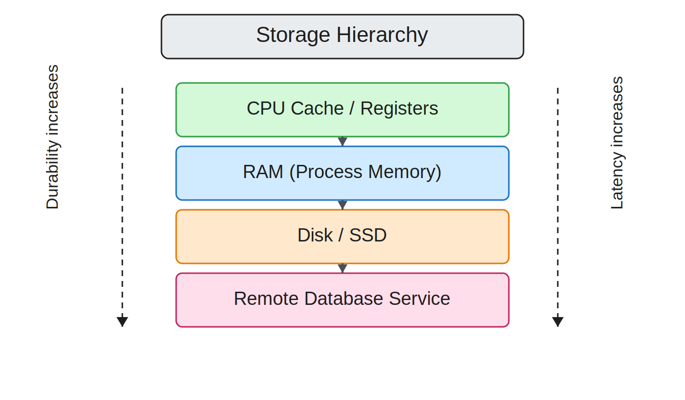

<style>
@import "./styles/main.css";
@import "./styles/styles.css";
</style>

# Persistence

## COMPSCI 326 Web Programming

<div class="text-2xl opacity-70 mt-6">
Lecture 6.9: Persistence
</div>

<!--
Presenter + Student Notes

Teaching goal:
Introduce the big idea for today: persistence is about keeping true data safe over time.

Say this clearly:
Memory is temporary. User trust is long-term. This lecture is about closing that gap.

Student takeaway:
By the end, you should explain what to persist, where the boundary belongs, and how to test it.
-->

---
layout: two-cols-header
class: text-2xl community-agreement
---

# Community Agreement

::left::

- **Attend & Engage:** Show up every class and be fully present - learning improves when we participate together.
- **Stay Focused:** No devices in class (unless asked); laptops and phones pull attention away from you and others.
- **Use AI Responsibly:** AI tools are allowed when used transparently and to support, not replace, your own thinking.

::right::

- **Learn with a Growth Mindset:** Mistakes and questions are part of the process, ask early and often.
- **Respect & Include Everyone:** Value diverse experiences, assume positive intent, and maintain a safe space for questions.
- **Support Each Other:** Collaborate to help peers understand, not just finish work; listen generously.

<!--
Presenter + Student Notes

Teaching goal:
Set expectations for how we will learn together today.

Instructor cue:
Read each point quickly, then pause on AI use and collaboration norms.

Student takeaway:
Participation, respect, and honest effort are part of technical quality.
-->

---
class: text-2xl
---

# Schedule

- Homework 01 Due 3/3 at 11:59 PM
- Homework 02 to be released Thursday
- Exam 02 Friday in Lab
- Exercises coming soon

**See syllabus for policies around assignments.**

<!--
Presenter + Student Notes

Teaching goal:
Align everyone on deadlines and course timing.

Instructor cue:
Call out dates out loud and point students to the syllabus for policy details.

Student takeaway:
Know what is due and plan your week now, not later.
-->

---
class: text-2xl
---

# Agenda

- Mental model and key vocabulary
- Runtime vs persistent demos
- Failure + concurrency reasoning
- Repository boundary and testing
- In-class design exercise and debrief

**Target Outcome:** you should be able to explain not only _what_ to store, but _where_ the persistence boundary belongs and how to verify it.

<!--
Presenter + Student Notes

Teaching goal:
Give a roadmap so students can connect each section.

Say this clearly:
We move from concepts, to demos, to failure reasoning, to design practice.

Student takeaway:
Each section builds toward one outcome: defensible persistence design.
-->

---
class: text-2xl
---

# Reading (How to Use It)

- Primary reading: [6.9 Persistence](https://timdrichards.github.io/326/docs/readings/persistence)
- During class: use slides for pacing + demos
- After class: use reading sections for exam prep and reimplementation

Reading-first workflow:

1. Understand concept sections (1-5).
2. Re-run code examples (6-18).
3. Practice debugging/testing prompts (20-30).

<!--
Presenter + Student Notes

Teaching goal:
Show students how to use the reading as a study workflow, not just a reference.

Instructor cue:
Emphasize sequence: concepts first, code second, practice prompts third.

Student takeaway:
Follow this order to prepare for both implementation and exam questions.
-->

---
class: text-2xl
---

# Lecture-Reading Map

<div class="h-4"></div>

- Concept model in lecture → sections 1-5
- Code demos in lecture → sections 6-18
- Debugging/testing in lecture → sections 20-25
- Exam prep in lecture → sections 29-30

<!--
Presenter + Student Notes

Teaching goal:
Map lecture segments to exact reading sections.

Instructor cue:
Point out that debugging and testing sections are required, not optional.

Student takeaway:
If you miss class details, this map tells you where to recover them.
-->

---
class: text-2xl
---

# Why Persistence Exists

- Programs terminate.
- Process memory is volatile.
- Users still expect data tomorrow.

Persistence exists because user expectations span process lifetimes. 

If canonical state only lives in memory, your app resets truth every restart.

<p class="reading-connection">Reading connection: section 1.</p>

<!--
Presenter + Student Notes

Teaching goal:
Anchor persistence in user expectations.

Say this clearly:
Apps restart. Users still expect their data to be there tomorrow.

Student takeaway:
Persistence is not a bonus feature. It is a baseline requirement.
-->

---
layout: two-cols-header
class: text-3xl community-agreement precise-definition
---

## A Precise Definition of Persistence


::left::

Persistence means state survives process restart and is retrievable later.

Durability is the stronger guarantee: once a write is treated as committed, it should remain after failure.

::right::

Vocabulary to use precisely:

- Volatile state
- Persistent state
- Durable write
- Invariant

<p class="reading-connection">Reading connection: section 3.</p>

<!--
Presenter + Student Notes

Teaching goal:
Separate everyday language from technical language.

Instructor cue:
Contrast persistence and durability in one sentence.

Student takeaway:
Use terms precisely: volatile state, persistent state, durable write, invariant.
-->

---
class: text-2xl
---

## Core Persistence Vocabulary

- **Volatile state:** Data that exists only while the process is running (for example, in RAM).
- **Persistent state:** Data stored so it can be recovered after restart.
- **Durable write:** A write treated as committed and expected to survive failures.
- **Invariant:** A rule that must remain true across every valid system state.

<!--
Presenter + Student Notes

Teaching goal:
Build shared vocabulary before design discussions.

Instructor cue:
Ask for one real example of each term from a familiar app.

Student takeaway:
Clear words lead to clearer architecture decisions.
-->

---
class: text-2xl
---

## The Core Problem Statement

Persistence work **must solve all three**:

- Keep canonical state beyond runtime.
- Retrieve and update it reliably.
- Preserve correctness under failure and concurrency.

<div class="callout callout-danger callout-gap-top">
If any one is missing, the system can still lose or corrupt user truth.
</div>

<p class="reading-connection">Reading connection: sections 2 and 11-12.</p>

<!--
Presenter + Student Notes

Teaching goal:
Show that persistence is a three-part correctness problem.

Say this clearly:
Storage alone is not enough. Retrieval and correctness under stress matter too.

Student takeaway:
If one of the three parts fails, users lose trust.
-->

---
layout: two-cols-header
class: text-2xl body-sm body-tight
---

## Data Lifetime Categories

::left::

- **Request-lifetime:** exists only while one HTTP request is being handled.
- **Session-lifetime:** survives across multiple requests for one user session.
- **Application-lifetime:** stays in memory while the server process is running.

::right::

- **Long-lived/persistent:** stored outside process memory so it survives restarts.

<div class="sticky-note">
This classification prevents <br><strong>two common mistakes</strong>:

- Persisting transient state unnecessarily
- Leaving critical canonical state in volatile memory
</div>

<p class="reading-connection">Reading connection: section 4.</p>

<!--
Presenter + Student Notes

Teaching goal:
Teach students to classify data before choosing storage.

Instructor cue:
Give one quick example for request, session, app, and long-lived data.

Student takeaway:
Do not persist temporary state, and do not leave canonical state in RAM.
-->

---
layout: two-cols-header
class: text-2xl body-sm
---

## Storage Hierarchy (Mental Model)

::left::

- **CPU/cache + RAM:** <br>fast, volatile
- **Disk/SSD:** <br>slower, persistent
- **Remote DB:** <br>shared + network latency

<div class="callout">
<strong>Design Implication</strong><br>Speed and durability trade off. Good architecture places each state type in the right layer.
</div>

<p class="reading-connection">Reading connection: section 5.</p>

::right::



<!--
Presenter + Student Notes

Teaching goal:
Connect storage choice to speed, durability, and sharing.

Instructor cue:
Call out tradeoffs, not just definitions.

Student takeaway:
Good systems place each kind of state in the right layer.
-->

---
class: text-2xl body-sm
---

## Volatile vs Persistent (Demo 00)

`examples/00-runtime-vs-persistent/src/inMemoryCounter.ts`

```ts {1|1-6|1,8-10}
let count = 0;

export function increment(): number {
  count += 1;
  return count;
}

export function getCount(): number {
  return count;
}
```

Module-level memory lasts only as long as one process.

<p class="reading-connection">Reading connection: sections 6-7.</p>

<!--
Presenter + Student Notes

Teaching goal:
Make volatility concrete with a tiny example.

Instructor cue:
Ask: what happens to count after process restart?

Student takeaway:
Module memory feels convenient but disappears when the process ends.
-->

---
class: text-2xl
---

## Persistence Boundary in Web Apps

- Browser memory and server memory are separate runtimes.
- Server restarts wipe server in-memory state.
- Canonical shared truth must cross a persistence boundary.

Do not confuse **visible UI state** with persisted state. 

*This is a boundary distinction.*

<p class="reading-connection">Reading connection: section 9.</p>

<!--
Presenter + Student Notes

Teaching goal:
Separate browser state from server canonical state.

Say this clearly:
UI state can look correct while backend truth is still wrong.

Student takeaway:
The persistence boundary is a backend architecture decision.
-->

---
class: text-2xl
---

## Canonical State and Sources of Truth

- Canonical values must be persisted.
- Derived values can be recomputed.
- Prefer one authoritative source of truth.

**Example:**

- Journal entry body is canonical.
- Sort order in a view is typically derived.

<p class="reading-connection">Reading connection: section 2.</p>

<!--
Presenter + Student Notes

Teaching goal:
Train students to identify what must never be lost.

Instructor cue:
Ask students to label one canonical and one derived field in a known app.

Student takeaway:
Persist authoritative truth; recompute derived views when possible.
-->

---
class: text-2xl  body-sm
---

## Modeling Persistent State

- Identity (`id`)
- Attributes (fields)
- Constraints (required, unique, valid)
- Invariants preserved after every write

**Example (`JournalEntry`):**

- Identity: `id`
- Attributes: `content`, `createdAt`, `updatedAt`
- Constraints: `content` must be non-empty
- Invariant: every persisted entry always has valid `content`

<p class="reading-connection">Reading connection: sections 10 and 15.</p>

<!--
Presenter + Student Notes

Teaching goal:
Show how data modeling supports correctness.

Instructor cue:
Walk through id, attributes, constraints, and invariant as one package.

Student takeaway:
Persistence design starts with a clear model, not with random CRUD endpoints.
-->

---
class: text-2xl
---

## CRUD Is Necessary but Not Sufficient

CRUD gives operation surface area. <br>
**It does not guarantee correctness.**

<u>Correctness Over Time Requires</u>:

- Invariant enforcement
- Failure-aware write behavior
- Concurrency-safe updates

<p class="reading-connection">Reading connection: section 11.</p>

<!--
Presenter + Student Notes

Teaching goal:
Break the common misconception that CRUD equals correctness.

Say this clearly:
You can have full CRUD and still lose data under failure or concurrency.

Student takeaway:
Correctness requires invariants, failure handling, and safe updates.
-->

---
class: framed-lists-red text-2xl
---

## Failure Modes You Must Design For

- Crash between read and write
- Partial write output
- Concurrent overwrite (lost update)
- Corrupted stored data

**If design assumes perfect execution, it is fragile by default.**

<div class="callout callout-danger">
If you cannot describe failure behavior, you do not yet have a production-ready persistence design.
</div>

<p class="reading-connection">Reading connection: section 12.</p>

<!--
Presenter + Student Notes

Teaching goal:
Normalize failure-aware thinking as a design habit.

Instructor cue:
Pick one failure mode and ask what the system should do.

Student takeaway:
If failure behavior is undefined, the design is incomplete.
-->

---
class: text-2xl
---

## Atomicity (Concept)

- Change should happen entirely or not at all.
- Half-applied state causes integrity bugs.
- **For this lecture:** model with temp-write + rename.

**Important nuance from reading:** <br> 
This is the right teaching pattern here, not a claim of full cross-filesystem guarantees.

<p class="reading-connection">Reading connection: section 8.</p>

<!--
Presenter + Student Notes

Teaching goal:
Define atomicity in practical, beginner-friendly terms.

Instructor cue:
Use the phrase: all-or-nothing change.

Student takeaway:
Half-written state creates hard-to-debug integrity problems.
-->

---
class: text-2xl code-md
---

## Atomic File Write Pattern (Demo 00)

`examples/00-runtime-vs-persistent/src/fileStore.ts`

````md magic-move
```ts
import { promises as fs } from "node:fs";

export async function writeJsonAtomic<T>() { }
```
```ts
import { promises as fs } from "node:fs";

export async function writeJsonAtomic<T>(
  filePath: string, 
  data: T): Promise<void> { }
```
```ts
import { promises as fs } from "node:fs";

export async function writeJsonAtomic<T>(
  filePath: string, 
  data: T): Promise<void> {
    // Create a temp file. Why?
    const tempPath = `${filePath}.tmp`;
}
```
```ts
import { promises as fs } from "node:fs";

export async function writeJsonAtomic<T>(
  filePath: string, 
  data: T): Promise<void> {
    const tempPath = `${filePath}.tmp`;
    // Write the JSON form of the data to the temp file.
    await fs.writeFile(tempPath, JSON.stringify(data), "utf8");
}
```
```ts
import { promises as fs } from "node:fs";

export async function writeJsonAtomic<T>(
  filePath: string, 
  data: T): Promise<void> {
    const tempPath = `${filePath}.tmp`;
    await fs.writeFile(tempPath, JSON.stringify(data), "utf8");
    // Rename the temp file → actual file
    // This is an ATOMIC operation!
    await fs.rename(tempPath, filePath);
}
```
```ts
import { promises as fs } from "node:fs";

export async function writeJsonAtomic<T>(
  filePath: string, 
  data: T): Promise<void> {
    const tempPath = `${filePath}.tmp`;
    await fs.writeFile(tempPath, JSON.stringify(data), "utf8");
    await fs.rename(tempPath, filePath);
}
```
````

<!--
We need to come back to this later as a great example of race condition.
This is why we use a database!
-->

<!--
Presenter + Student Notes

Teaching goal:
Explain why temp write plus rename is safer than direct overwrite.

Instructor cue:
Walk line by line: temp path, write temp, rename to final.

Student takeaway:
This pattern reduces partial-write risk in simple file-backed storage.
-->

---
class: text-2xl code-md
---

## Atomic File Read Pattern (Demo 00)

`examples/00-runtime-vs-persistent/src/fileStore.ts`

````md magic-move
```ts
export async function readJson<T>() { }
```
```ts
export async function readJson<T>(filePath: string): Promise<T | null> { }
// Returns a Promise<T | null>
// What does this mean?
```
```ts
export async function readJson<T>(filePath: string): Promise<T | null> {
    // Try to read the file.
    const raw = await fs.readFile(filePath, "utf8");
    // But, what if there is a failure?
}
```
```ts
export async function readJson<T>(filePath: string): Promise<T | null> {
  // Surround with a try/catch
  try {
    const raw = await fs.readFile(filePath, "utf8");    
  } catch {
    // What do we do here?
  }
}
```
```ts
export async function readJson<T>(filePath: string): Promise<T | null> {  
  try {
    const raw = await fs.readFile(filePath, "utf8");
    // Parse JSON text into a JS object of type T and return it
    return JSON.parse(raw) as T; 
  } catch {
    // What do we do here?
  }
}
```
```ts
export async function readJson<T>(filePath: string): Promise<T | null> {  
  try {
    const raw = await fs.readFile(filePath, "utf8");
    return JSON.parse(raw) as T; 
  } catch {
    // Signals that there was a failure.
    // But, we no better... this is a small example.
    return null;
  }
}
```
````

Teaching points:

- Serialization/deserialization boundary
- `Promise<void>` vs `Promise<T | null>`

<!--
This is going to persist a JSON file to disk.
-->

<!--
Presenter + Student Notes

Teaching goal:
Show the read boundary and explicit failure signaling.

Instructor cue:
Explain why this demo returns null on failure and why production code may validate more.

Student takeaway:
Reading persisted data always needs error handling and parsing logic.
-->

---
class: text-2xl
---

### Concurrency Hazards (Even on One Server)

- Requests interleave.
- Read-modify-write can lose updates.
- Timing can break logic that looks correct in isolation.

This has a name: **race condition**

<p class="reading-connection">Reading connection: section 13.</p>

<!--
Presenter + Student Notes

Teaching goal:
Correct the myth that one server means no races.

Say this clearly:
Asynchronous requests interleave, so timing bugs can still happen.

Student takeaway:
Race conditions are about overlap, not server count.
-->

---


## Lost Update Example (Demo 01)

`examples/01-race-condition/src/cartService.ts`

````md magic-move
```ts
// Let us define a type
export type CartRecord = { quantity: number };
```
```ts {3-6}
export type CartRecord = { quantity: number };

// A simple CartService class with some private state
export class CartService {
  private state: CartRecord = { quantity: 0 };
}
```
```ts {6-9}
export type CartRecord = { quantity: number };

export class CartService {
  private state: CartRecord = { quantity: 0 };

  // A typical getter to get the quantity if updated
  getQuantity(): number {
    return this.state.quantity;
  }
}
```
```ts {6-9}
export type CartRecord = { quantity: number };

export class CartService {
  private state: CartRecord = { quantity: 0 };

  // Now we are going to demonstrate a race condition
  async incrementWithRace(): Promise<number> { 
    // ...
  }

  getQuantity(): number {
    return this.state.quantity;
  }
}
```
```ts {1-6}
  // Now we are going to demonstrate a race condition
  async incrementWithRace(): Promise<number> { 
    // 1. We get the current quantity
    // 2. Create a timer that resolves in 10 ms -> we wait for this
    // 3. After the timer goes off -> we increment the state and return
  }
```
```ts {3-4}
  // Now we are going to demonstrate a race condition
  async incrementWithRace(): Promise<number> { 
    // 1. We get the current quantity
    const current = this.state.quantity;
    // 2. Create a timer that resolves in 10 ms -> we wait for this
    // 3. After the timer goes off -> we increment the state and return
  }
```
```ts {3-7}
  // Now we are going to demonstrate a race condition
  async incrementWithRace(): Promise<number> { 
    // 1. We get the current quantity
    const current = this.state.quantity;

    // 2. Create a timer that resolves in 10 ms -> we wait for this
    await new Promise((resolve) => setTimeout(resolve, 10));

    // 3. After the timer goes off -> we increment the state and return
  }
```
```ts {3-11}
  // Now we are going to demonstrate a race condition
  async incrementWithRace(): Promise<number> { 
    // 1. We get the current quantity
    const current = this.state.quantity;

    // 2. Create a timer that resolves in 10 ms -> we wait for this
    await new Promise((resolve) => setTimeout(resolve, 10));
    
    // 3. After the timer goes off -> we increment the state and return
    this.state.quantity = current + 1;
    return this.state.quantity;    
  }
```
```ts
export type CartRecord = { quantity: number };

export class CartService {
  private state: CartRecord = { quantity: 0 };

  async incrementWithRace(): Promise<number> {
    const current = this.state.quantity;
    await new Promise((resolve) => setTimeout(resolve, 10));
    this.state.quantity = current + 1;
    return this.state.quantity;
  }
}
```
````

<v-switch>
  <template #0-1> <b>What</b> is the problem? </template>
  <template #1> What happens when we run this code? </template>  
</v-switch>

<p class="reading-connection">Reading connection: sections 13-14.</p>

<!--
Presenter + Student Notes

Teaching goal:
Reveal how a simple read-modify-write pattern can fail.

Instructor cue:
Pause at await and ask what other requests can do during that wait.

Student takeaway:
Two requests can read the same old value and overwrite each other.
-->

---

## Running Lost Update (Demo 01)

```bash {*|6|6-7|8}
npm run demo

  - example-01-race-condition@1.0.0 demo
  - tsx src/demo.ts

Results of concurrent increments: [ 1, 1, 1, 1, 1 ]
Final quantity: 1
Expected quantity if no race existed: 5
```

<v-switch>
  <template #0-1> How could this happen? </template>  
</v-switch>

<!--
Presenter + Student Notes

Teaching goal:
Use observed output to prove the bug is real.

Instructor cue:
Compare expected final value and actual final value out loud.

Student takeaway:
Correct-looking code can fail under concurrency tests.
-->

---
class: text-2xl cols-70-30
layout: two-cols-header
---

## Lost Update Timeline (Visual)

::left::


::right::

Both requests can read the same old value before either write completes.

This is exactly the problem in the code example!

<!--
Presenter + Student Notes

Teaching goal:
Visualize interleaving so timing becomes easy to reason about.

Instructor cue:
Trace request A and B in time order, not code order.

Student takeaway:
When reads happen before writes complete, lost updates are likely.
-->

---
class: text-2xl
layout: two-cols-header
layoutClass: cols-30-70
---

## Lost Update Timeline (Visual)

::left::

```ts {*|7|8|8|8|7,9}
export type CartRecord = { quantity: number };

export class CartService {
  private state: CartRecord = { quantity: 0 };

  async incrementWithRace(): Promise<number> {
    const current = this.state.quantity;
    await new Promise((resolve) => setTimeout(resolve, 10));
    this.state.quantity = current + 1;
    return this.state.quantity;
  }
}
```

::right::

<template v-if="$clicks === 1">

  Each time we call `incrementWithRace()`, the current state is fetched.

  **`current` is the state.**

</template>
<template v-else-if="$clicks === 2">

  Then we start a 10 ms timer by creating a Promise and awaiting it.

  `await` pauses this function, but it does not pause the whole program.

</template>
<template v-else-if="$clicks === 3">
  
  While this function is waiting, other requests can run and read the same old  
  value.

</template>
<template v-else-if="$clicks === 4">

  This is an asynchronous operation.
  
  This allows other calls to `incrementWithRace` to occur.

</template>
<template v-else-if="$clicks === 5">

  All of those calls store the current state into `current`, so they will overwrite each other.

</template>

<!--
Presenter + Student Notes

Teaching goal:
Connect timeline behavior directly to specific lines of code.

Instructor cue:
Use clicks to explain where state is captured, paused, then overwritten.

Student takeaway:
The bug lives in the gap between read and write, especially around await.
-->

---
class: text-2xl
---

## Repository Boundary Pattern

- Put persistence behind an interface.
- Services depend on contracts, not storage APIs.
- This isolates IO details from domain behavior.

☑ The repository boundary is the key design decision.

<p class="reading-connection">Reading connection: section 15.</p>

<!--
Presenter + Student Notes

Teaching goal:
Show why boundaries make persistence maintainable.

Say this clearly:
Business logic should depend on contracts, not filesystem or database APIs.

Student takeaway:
A clean boundary makes testing easier and implementation swaps safer.
-->

---
class: text-2xl
---

## Repository Interface Example (Demo 02)

```ts [examples/02-repository-boundary/src/EntryRepository.ts]
export interface EntryRepository {
  create(input: CreateEntryInput): Promise<Entry>;
  findById(id: string): Promise<Entry | null>;
  list(): Promise<Entry[]>;
}
```

<div class="h-6"></div>

- Stable method signatures preserve calling code.
- Interface-first design enables storage swaps.

<p class="reading-connection">Reading connection: section 15 + Appendix B.</p>

<!--
Presenter + Student Notes

Teaching goal:
Demonstrate a stable contract for persistence operations.

Instructor cue:
Point out that callers do not care how storage is implemented.

Student takeaway:
Interface-first design protects the rest of the app from storage changes.
-->

---
class: text-2xl
---

### In-Memory vs File-Backed Implementations

- `InMemoryEntryRepository.ts`: fast, volatile
- `JsonFileEntryRepository.ts`: durable across restarts
- Same interface, different durability/performance tradeoffs

**This is the continuity bridge into Prisma later:**
- preserve boundary, swap implementation

<p class="reading-connection">Reading connection: sections 16-18.</p>

<!--
Show the code for InMemory and JsonFile...
-->

<!--
Presenter + Student Notes

Teaching goal:
Compare same interface, different durability tradeoffs.

Instructor cue:
Ask: what changes for callers when implementation changes?

Student takeaway:
If the boundary is clean, callers stay the same while storage evolves.
-->

---
class: text-2xl
---

### In-Memory Implementation

Remember this from our Journal App:

````md magic-move [02-repository-boundary/src/InMemoryEntryRepository.ts]
```ts
import { randomUUID } from "node:crypto";
import { CreateEntryInput, Entry, EntryRepository } from "./EntryRepository";

export class InMemoryEntryRepository implements EntryRepository {
  private readonly entries = new Map<string, Entry>();

  async create(input: CreateEntryInput): Promise<Entry> { 
    // ...
  }

  async findById(id: string): Promise<Entry | null> {
    return this.entries.get(id) ?? null;
  }

  async list(): Promise<Entry[]> {
    return Array.from(this.entries.values());
  }
}
```
```ts
import { randomUUID } from "node:crypto";
import { CreateEntryInput, Entry, EntryRepository } from "./EntryRepository";
```
```ts {4-6}
export class InMemoryEntryRepository implements EntryRepository {
  private readonly entries = new Map<string, Entry>();

  async findById(id: string): Promise<Entry | null> {
    return this.entries.get(id) ?? null;
  }
}
```
```ts {8-10}
export class InMemoryEntryRepository implements EntryRepository {
  private readonly entries = new Map<string, Entry>();

  async findById(id: string): Promise<Entry | null> {
    return this.entries.get(id) ?? null;
  }

  async list(): Promise<Entry[]> {
    return Array.from(this.entries.values());
  }
}
```
```ts {4-13}
export class InMemoryEntryRepository implements EntryRepository {
  private readonly entries = new Map<string, Entry>();

  async create(input: CreateEntryInput): Promise<Entry> {
    const entry: Entry = {
      id: randomUUID(),
      title: input.title,
      body: input.body,
      createdAt: new Date().toISOString(),
    };
    this.entries.set(entry.id, entry);
    return entry;
  }
}
```
````

<!--
Presenter + Student Notes

Teaching goal:
Show a fast and simple implementation for development/testing.

Instructor cue:
Remind students this implementation is volatile by design.

Student takeaway:
In-memory repositories are useful, but not sufficient for durable user data.
-->

---
class: text-2xl
---

### JSON Persistent Implementation

````md magic-move
```ts
import { promises as fs } from "node:fs";
import { randomUUID } from "node:crypto";
import { CreateEntryInput, Entry, EntryRepository } from "./EntryRepository";
```
```ts
export class JsonFileEntryRepository implements EntryRepository {
  constructor(private readonly filePath: string) {}
}
```
```ts {2-10|12-17}
export class JsonFileEntryRepository implements EntryRepository {
  // A method to read all entries from persistent storage
  private async readAll(): Promise<Entry[]> {
    try {
      const raw = await fs.readFile(this.filePath, "utf8");
      return JSON.parse(raw) as Entry[];
    } catch {
      return [];
    }
  }

  // A method to write all entries to persistent storage
  private async writeAll(entries: Entry[]): Promise<void> {
    const tempPath = `${this.filePath}.tmp`;
    await fs.writeFile(tempPath, JSON.stringify(entries, null, 2), "utf8");
    await fs.rename(tempPath, this.filePath);
  }
}
```
```ts {2-6|8-11}
export class JsonFileEntryRepository implements EntryRepository {
  // Look up by ID
  async findById(id: string): Promise<Entry | null> {
    const entries = await this.readAll();
    return entries.find((entry) => entry.id === id) ?? null;
  }

  // List all entries
  async list(): Promise<Entry[]> {
    return this.readAll();
  }
}
```
````

<!--
Presenter + Student Notes

Teaching goal:
Show a durable implementation behind the same repository contract.

Instructor cue:
Highlight readAll/writeAll and the temp-write-rename pattern.

Student takeaway:
Durability improves while the interface stays stable.
-->

---
class: text-2xl framed-lists-green
layout: two-cols-header
layoutClass: cols-50-50 title-tight exercise-compact
---

::left::

### In-Class Activity

**Persistence Design Drill**

Pick **1 scenarios** and fill in design blanks. Scenarios:

- A) Save a journal entry draft (do not pick this one)
- B) Increment cart item quanatity
- C) Mark a task complete
- D) Rename a project

For each scenario, produce:

1. Canonical state
2. Invariant
3. Failure risk
4. Repository boundary method
5. One restart-style verification test

::right::

<div class="callout">
Goal: make your design defensible under restart, failure, and concurrency.
</div>

<div class="sticky-note text-base">

<strong>Example (A: Save a journal draft)</strong>
1. Canonical state: draft id + draft content
2. Invariant: draft content is non-empty
3. Failure risk: crash after user clicks save, before write completes
4. Repository boundary: <code>saveDraft(id, content)</code>
5. Verification test: write draft → restart server → draft still loads

</div>

<!--
Presenter + Student Notes

Teaching goal:
Practice persistence design using real scenarios.

Instructor cue:
Require all five outputs: canonical state, invariant, failure risk, boundary method, restart test.

Student takeaway:
A good design is one you can defend under restart, failure, and concurrency.
-->

---
class: text-2xl
---

## Practical Express/HTMX Integration

- Route handlers orchestrate HTTP + rendering.
- Repository handles persistence IO.
- This keeps transport concerns separate from durability concerns.

**Key Reminder:** frontend interaction style does not remove backend persistence responsibility.

<p class="reading-connection">Reading connection: sections 22-24.</p>

<!--
Presenter + Student Notes

Teaching goal:
Connect persistence architecture to your course stack.

Say this clearly:
HTMX changes rendering style, not backend durability responsibility.

Student takeaway:
Route handlers orchestrate. Repositories persist canonical truth.
-->

---
class: text-2xl
---

## The Focus

We **are not** doing this:
- SQL optimization
- Distributed transaction patterns

We **are** doing this:
- ORM internals (Object-Relational Mapping)

**Scope Discipline Matters:** 
- This lecture builds *boundary* + *correctness* model first.

<!--
Presenter + Student Notes

Teaching goal:
Protect scope so students learn the right abstraction level first.

Instructor cue:
State explicitly what is out of scope and why.

Student takeaway:
Today is about boundaries and correctness, not advanced database tuning.
-->

---
class: text-2xl
---

## What to Internalize

- Persistence is architecture, not just API calls.
- Durable systems require boundaries, <br> invariants, and tests.
- Correctness must survive restart and concurrency.

<p class="reading-connection">Reading connection: sections 32-33.</p>

<!--
Presenter + Student Notes

Teaching goal:
Summarize the non-negotiable ideas from the lecture.

Instructor cue:
Read each bullet slowly and tie it back to one demo.

Student takeaway:
Persistence quality is measured by behavior over time, not by API usage.
-->

---
class: text-2xl
---

## How to Study This Lecture

- Re-run all three demos from the reading.
- Use Appendix A to tighten vocabulary (`process`, `durability`, `invariant`).
- Use Appendix B for API references.
- Complete section 30 practice prompts.

If you can answer the practice prompts without notes, you are ready for implementation and exam reasoning.

<!--
Presenter + Student Notes

Teaching goal:
Give a concrete study plan students can follow immediately.

Instructor cue:
Encourage active practice: rerun demos and answer prompts without notes.

Student takeaway:
Mastery comes from reimplementation and reasoning, not passive reading.
-->

---
class: text-2xl
---

## Where We Go Next (Prisma Lecture)

- Swap repository implementation to Prisma.
- Preserve repository contract.
- Preserve mental model and test strategy.

Better tooling **should not require** rethinking 
<br> core architecture.

<p class="reading-connection">Reading connection: section 27.</p>

<!--
Presenter + Student Notes

Teaching goal:
Bridge from current patterns to next lecture tooling.

Say this clearly:
We are swapping implementation, not abandoning the mental model.

Student takeaway:
Better tools should preserve good architecture, not replace it.
-->
