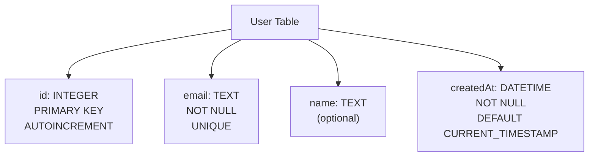
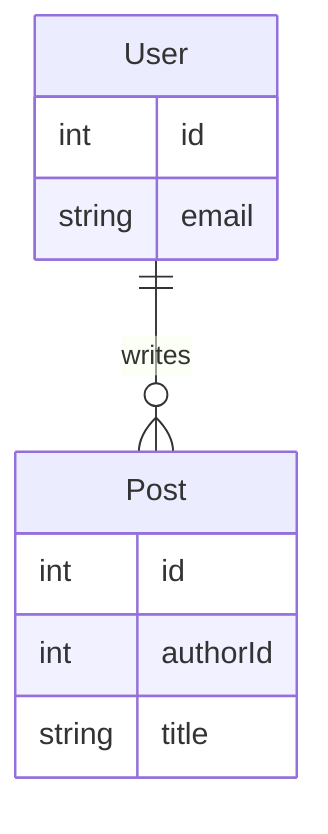
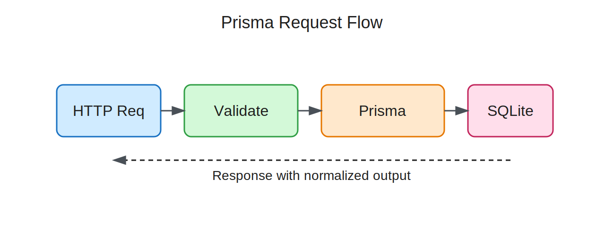

<style>
@import "./styles/main.css";
@import "./styles/styles.css";
</style>

# ORM and Prisma

## COMPSCI 326 Web Programming

<div class="text-2xl opacity-70 mt-6">
Lecture 6.10: Object-Relational Mapping
</div>

---
layout: two-cols-header
class: text-2xl community-agreement
---

## Community Agreement

::left::

- **Attend & Engage:** Show up every class and be fully present - learning improves when we participate together.
- **Stay Focused:** No devices in class (unless asked); laptops and phones pull attention away from you and others.
- **Use AI Responsibly:** AI tools are allowed when used transparently and to support, not replace, your own thinking.

::right::

- **Learn with a Growth Mindset:** Mistakes and questions are part of the process, ask early and often.
- **Respect & Include Everyone:** Value diverse experiences, assume positive intent, and maintain a safe space for questions.
- **Support Each Other:** Collaborate to help peers understand, not just finish work; listen generously.

---
class: text-2xl
---

## Agenda

- Connect to persistence (last lecture)
- Database basics from zero
- SQL basics from zero
- ORM and Prisma fundamentals
- In-class activity + wrap-up

**Outcome:** you can explain *what* Prisma does, *why* it helps, and *where* it belongs.

---
class: text-2xl
---

## Connection to Last Lecture

Last time, we said:

- Canonical state must survive restart
- Boundaries matter
- Tests should prove behavior

Today:

- We keep the same architecture
- We change tooling inside the persistence boundary

---
class: text-2xl
---

## Why Databases Exist

- App memory is temporary
- Users expect data tomorrow
- Many users can edit data at once

A database gives us structured, reliable storage over time.

---
class: text-2xl
---

## What Is a Relational Database?

- Stores data in tables
- Connects tables with relations
- Uses SQL for queries

Think: clear structure + clear rules + clear lookup language.

---
class: text-2xl
---

## Relational History in 30 Seconds

- **1960s:** app-specific storage patterns
- **1970:** E. F. Codd proposes relational model
- **1970s-80s:** research -> products
- **Today:** still a core model in web systems

This was invented to reduce data chaos and improve maintainability.

---
class: text-2xl
---

## Before vs After Relational

| Dimension | Before (Typical) | After (Typical) |
| --- | --- | --- |
| Structure | App-specific formats | Shared schema |
| Access | Custom traversal code | SQL queries |
| Relations | Hidden in code | Explicit keys |
| Change cost | High | Lower |

---
class: text-2xl
---

## Vocabulary You Need

- **Table:** named collection of rows
- **Column:** one field definition
- **Row:** one record instance
- **Schema:** full structure + rules
- **Query:** request to read/change data
- **SQL:** language for relational queries

---
class: text-xl
---

## Table Example

```text {1|2-4|4-7}
Table: User
+----+----------------------+-------------+
| id | email                | name        |
+----+----------------------+-------------+
| 1  | ava@school.edu       | Ava         |
| 2  | ben@school.edu       | Ben         |
+----+----------------------+-------------+
```

---
class: text-xl
---

## Columns, Types, Constraints

```sql {1|2|3|4|5}
CREATE TABLE User (
  id INTEGER PRIMARY KEY AUTOINCREMENT,
  email TEXT NOT NULL UNIQUE,
  name TEXT,
  createdAt DATETIME NOT NULL DEFAULT CURRENT_TIMESTAMP
);
```

- `id`: stable identity
- `email`: required + no duplicates
- `name`: optional
- `createdAt`: auto timestamp if not provided

---
class: text-xl
---

## Table Structure Diagram



Structure + constraints in one place = fewer bugs later.

---
class: text-4xl
---

## Rows and Identity Operations

```sql {1|2|3|all}
INSERT INTO User (email, name) VALUES ('ava@school.edu', 'Ava');
SELECT id, email, name FROM User WHERE id = 1;
UPDATE User SET name = 'Ava Li' WHERE id = 1;
```

<div class="text-2xl leading-relaxed" v-if="$clicks === 0">
  <p><strong>Line 1:</strong> Insert one new user row.</p>
  <p>The database creates a stable <code>id</code> for this record.</p>
</div>

<div class="text-2xl leading-relaxed" v-else-if="$clicks === 1">
  <p><strong>Line 2:</strong> Read one exact row by ID.</p>
  <p><code>WHERE id = 1</code> is precise and predictable.</p>
</div>

<div class="text-2xl leading-relaxed" v-else-if="$clicks === 2">
  <p><strong>Line 3:</strong> Update only that row's <code>name</code>.</p>
  <p>Other rows stay unchanged because the ID filter targets one record.</p>
</div>

<div class="text-2xl leading-relaxed" v-else>
  <p><strong>Key idea:</strong> IDs make create/read/update operations safe and targeted.</p>
</div>

---
class: text-xl
---

## Row State Before and After

````md magic-move
```text
Before: INSERT INTO User (email, name) VALUES ('ava@school.edu', 'Ava');
+----+-------+------+
| id | email | name |
+----+-------+------+
|    (empty table)  |
+----+-------+------+
```
```text
After: INSERT INTO User (email, name) VALUES ('ava@school.edu', 'Ava');
+----+----------------+------+
| id | email          | name |
+----+----------------+------+
| 1  | ava@school.edu | Ava  |
+----+----------------+------+
```
```text
Before: UPDATE User SET name = 'Ava Li' WHERE id = 1;
+----+----------------+------+
| id | email          | name |
+----+----------------+------+
| 1  | ava@school.edu | Ava  |
+----+----------------+------+
```
```text
After: UPDATE User SET name = 'Ava Li' WHERE id = 1;
+----+----------------+--------+
| id | email          | name   |
+----+----------------+--------+
| 1  | ava@school.edu | Ava Li |
+----+----------------+--------+
```
````

---
class: text-2xl
---

## Why ID Matters in Web Apps

- URLs often carry IDs: `/users/1`, `/posts/10/edit`
- Route handlers read ID params
- DB query uses `WHERE id = ...`

Stable IDs are how links, APIs, and database rows stay connected.

---
class: text-2xl
layout: two-cols
layoutClass: relation-tight
---

## What a Relation Is

<v-switch>
  <template #0>
    <div class="text-2xl leading-relaxed">
      <p>One user can have many posts; each post belongs to one user.</p>
    </div>
  </template>
  <template #1>
    <div class="text-2xl leading-relaxed">
    <p>What you are looking at is an entity-relationship (ER) view of two tables and the rule that connects them.</p>
  </div>
  </template>
  <template #2>
  <div class="text-2xl leading-relaxed">
  <p>The <code>User</code> box represents one table and shows a few key fields (<code>id</code>, <code>email</code>). <br><br> The <code>Post</code> box represents a second table and shows fields including <code>authorId</code>, which is the linking field.</p>
</div>
  </template>
  <template #3>
<div class="text-2xl leading-relaxed">
  <p>The connector <code>User ||--o{ Post : writes</code> is a compact way of saying <emph>one user can be related to many posts.</emph></p>
</div>
  </template>

  <template #4>
<div class="text-2xl leading-relaxed">
  <p>In plain language, one user record may have zero, one, or many post records, but each post points back to one author.</p>
  <p>That is the relationship your application depends on when it shows <emph>posts by this user</emph> or <emph>author of this post.</emph></p>
</div> 
  </template>
</v-switch>

<v-click />
<v-click />
<v-click />
<v-click />

::right::



---
class: text-2xl
layout: two-cols
layoutClass: cols-50-50
---

## Common Query Types

```sql {*|1-2|4-6|8-9|11-12}
-- Read
SELECT * FROM Post WHERE authorId = 1;

-- Insert
INSERT INTO Post (title, body, authorId) 
       VALUES ('Hello', 'Body', 1);

-- Update
UPDATE Post SET title = 'Updated' WHERE id = 10;

-- Delete
DELETE FROM Post WHERE id = 10;
```

<div class="text-sm">
<template v-if="$clicks === 1">
  <ul>
  <li>This query asks the database to return all columns for rows where <code>authorId</code> is exactly <code>1</code>. </li>
  <li>In other words, it filters the <code>Post</code> table down to posts written by one author.</li>
  <li>The result includes rows <code>10</code> and <code>11</code> because both rows match the condition <code>authorId = 1</code>, while row <code>12</code> is excluded because its <code>authorId</code> is <code>2</code>.</li>
  </ul>
</template>

<template v-else-if="$clicks === 2">
  <ul>
  <li>This query creates a new row in the <code>Post</code> table by supplying values for <code>title</code>, <code>body</code>, and <code>authorId</code>.</li>
  <li>The database assigns <code>id</code> automatically when <code>id</code> is configured as an auto-incrementing primary key.</li>
  <li>The key idea is that <code>INSERT</code> changes table state by adding one new record, not by changing existing rows.</li>
  </ul>
</template>

<template v-else-if="$clicks === 3">
  <ul>
  <li>This query modifies existing rows that match the <code>WHERE</code> condition.</li>
  <li>Here, only row <code>id = 10</code> is updated, so only its <code>title</code> changes.</li>
  <li>The <code>WHERE</code> clause is the safety mechanism that prevents accidental bulk updates, so every other row stays exactly the same.</li>
  </ul>
</template>

<template v-else-if="$clicks === 4">
  <ul>
  <li>This query removes rows that match the <code>WHERE</code> condition.</li>
  <li>Because <code>id</code> is a unique key, <code>WHERE id = 10</code> matches exactly one row, so one row is deleted.</li>
  <li>If the condition matched multiple rows, multiple rows would be removed, which is why delete queries should always be written and reviewed carefully.</li>
  </ul>
</template>
</div>

::right::

<div class="h-13"></div>

<div class="code-xs">

<template v-if="$clicks === 0">

```text
Reference Table: Post (before any example query runs)
+----+--------------+----------------+----------+
| id | title        | body           | authorId |
+----+--------------+----------------+----------+
| 10 | Intro to SQL | Basics of SQL  | 1        |
| 11 | ORM Overview | Why ORMs exist | 1        |
| 12 | CSS Notes    | Styling tips   | 2        |
+----+--------------+----------------+----------+
```

</template>

<template v-if="$clicks === 1">

```text
Result of SELECT * FROM Post WHERE authorId = 1
+----+--------------------+----------------+----------+
| id | title              | body           | authorId |
+----+--------------------+----------------+----------+
| 10 | Intro to SQL       | Basics of SQL  | 1        |
| 11 | ORM Overview       | Why ORMs exist | 1        |
+----+--------------------+----------------+----------+

Note: this did not modify the initial table - the result
      is a new table derived from the original table.
```

</template>

<template v-if="$clicks === 2">

```text
Post table after INSERT
+----+--------------------+------------------+----------+
| id | title              | body             | authorId |
+----+--------------------+------------------+----------+
| 10 | Intro to SQL       | Basics of SQL    | 1        |
| 11 | ORM Overview       | Why ORMs exist   | 1        |
| 12 | CSS Notes          | Styling tips     | 2        |
| 13 | Hello              | Body             | 1        |
+----+--------------------+------------------+----------+
```

</template>

<template v-if="$clicks === 3">

```text
Post table after UPDATE Post SET title = 'Updated' WHERE id = 10
+----+--------------------+------------------+----------+
| id | title              | body             | authorId |
+----+--------------------+------------------+----------+
| 10 | Updated            | Basics of SQL    | 1        |
| 11 | ORM Overview       | Why ORMs exist   | 1        |
| 12 | CSS Notes          | Styling tips     | 2        |
| 13 | Hello              | Body             | 1        |
+----+--------------------+------------------+----------+
```

</template>

<template v-if="$clicks === 4">

```text
Post table after DELETE FROM Post WHERE id = 10
+----+--------------------+------------------+----------+
| id | title              | body             | authorId |
+----+--------------------+------------------+----------+
| 11 | ORM Overview       | Why ORMs exist   | 1        |
| 12 | CSS Notes          | Styling tips     | 2        |
| 13 | Hello              | Body             | 1        |
+----+--------------------+------------------+----------+
```

</template>

</div>

---
class: text-xl
---

## SQL Basics with Clauses

```sql {1|2|3|4|5|6}
SELECT p.id, p.title, u.email
  FROM Post p
  JOIN User u ON p.authorId = u.id
  WHERE p.id > 0
  ORDER BY p.id DESC
  LIMIT 5;
```

Read it top to bottom as: 

- select
- source
- relation (e.g., table)
- filter
- sort
- capacity

---
class: text-xl
---

## SQL to Prisma (Same Intent)

````md magic-move
```sql [00-prisma-fundamentals/src/sqlToPrisma.ts]
SELECT p.id, p.title, u.email
  FROM Post p
  JOIN User u ON p.authorId = u.id
  ORDER BY p.id DESC
  LIMIT 5;
```
```ts {*|2|3|4-8|7} [00-prisma-fundamentals/src/sqlToPrisma.ts]
const posts = await prisma.post.findMany({
  orderBy: { id: "desc" },
  take: 5,
  select: {
    id: true,
    title: true,
    author: { select: { email: true } },
  },
});
```
````

<template v-if="$clicks === 0">

This SQL query is getting the `id`, `title`, and `email` from the **Post** and **User** tables.

It then sorts them by their `id` in descending order.

Lastly, it limits the results to only 5 rows.

</template>

<template v-if="$clicks === 1">

The same query can be represented in Prisma using a different, but familiar syntax.

This yields the same results, but it is arguably represented in a way that is a little more clear.

It is also expressable directly in your code.

</template>

<template v-if="$clicks === 2">
We order by the id in descending fashion.
</template>
<template v-if="$clicks === 3">
We are only going to "take" 5 results.
</template>
<template v-if="$clicks === 4">

We select the columns we want. In this case, `id`, `title`, and `author`.

</template>
<template v-if="$clicks === 5">

But, `author` requires us to access the nested `email` field.

</template>

---
class: text-xl
---

## What an ORM Is

````md magic-move
```ts
const rows = await db.query(
  "SELECT id, title FROM Post WHERE authorId = ? ORDER BY id DESC LIMIT 5",
  [authorId],
);
```
```ts [01-repository-boundary-api/src/PrismaPostRepository.ts]
const posts = await prisma.post.findMany({
  where: { authorId },
  orderBy: { id: "desc" },
  take: 5,
  select: { id: true, title: true },
});
```
````

ORMs reduce repetitive mapping code, but SQL thinking still matters.

---
class: text-xl
---

## Prisma in One Sentence

Prisma gives us:

- schema-first modeling
- generated typed client
- migration workflow

Same architecture. Better tooling ergonomics.

---
class: text-xl
---

## `schema.prisma` Fundamentals

<div class="code-xs">

```prisma {*|1-2|4-7|9-15|17-23} [00-prisma-fundamentals/prisma/schema.prisma]
generator client {
  provider = "prisma-client-js"
}

datasource db {
  provider = "sqlite"
  url      = env("DATABASE_URL")
}

model User {
  id        Int      @id @default(autoincrement())
  email     String   @unique
  name      String?
  posts     Post[]
  createdAt DateTime @default(now())
}

model Post {
  id        Int      @id @default(autoincrement())
  title     String
  body      String
  authorId  Int
  author    User     @relation(fields: [authorId], references: [id])
}
```

<template v-if="$clicks === 0">
At a glance: we create a Prisma client, create one user, then query that user's posts.
</template>
<template v-if="$clicks === 1">
Import <code>PrismaClient</code> from <code>@prisma/client</code> so app code can talk to the database.
</template>
<template v-if="$clicks === 2">
Create a Prisma client instance, then insert one user row with an email and display name.
</template>
<template v-if="$clicks === 3">
Query posts where <code>authorId</code> matches that user, sort newest first, and return at most 10 rows.
</template>

</div>

---
class: text-xl
---

## Prisma Client Basics

```ts {*|1|3-6|8-13} [00-prisma-fundamentals/src/prismaClientBasics.ts]
import { PrismaClient } from "@prisma/client";

const prisma = new PrismaClient();
const user = await prisma.user.create({
  data: { email: `user-${Date.now()}@school.edu`, name: "Avery" },
});

const posts = await prisma.post.findMany({
  where: { authorId: user.id },
  orderBy: { createdAt: "desc" },
  take: 10,
});
```

<template v-if="$clicks === 1">
Import <code>PrismaClient</code> so this file can send typed queries to the database.
</template>
<template v-if="$clicks === 2">
Create a Prisma client instance, then insert one <code>User</code> row with an email and name.
</template>
<template v-if="$clicks === 3">
Read posts by filtering on <code>authorId: user.id</code>, sort by <code>createdAt</code> descending, and limit the result to 10 rows.
</template>
<template v-if="$clicks === 4">
End-to-end flow: create a user first, then use that user's ID to fetch related posts.
</template>

---
class: text-xl
---

## Handling Common Errors

```ts {*|1-3|4-8} [00-prisma-fundamentals/src/createUserSafely.ts]
try {
  await prisma.user.create({ data: { email: "a@school.edu" } });
} catch (error: any) {
  if (error.code === "P2002") {
    return { ok: false, reason: "duplicate_email" };
  }

  throw error;
}
```

<template v-if="$clicks === 0">
Goal: attempt the write, and turn known storage failures into stable app-level responses.
</template>
<template v-if="$clicks === 1">
The <code>try</code> block runs the create operation, and <code>catch</code> handles database errors if the write fails.
</template>
<template v-if="$clicks === 2">
If Prisma returns <code>P2002</code> (unique constraint violation), we return a friendly duplicate-email result; otherwise we re-throw.
</template>

---
class: text-xl
---

## Transactions (All-or-Nothing)

```ts {*|1|2-4|6-12} [00-prisma-fundamentals/src/createPostWithAudit.ts]
await prisma.$transaction(async (tx) => {
  const createdPost = await tx.post.create({
    data: { title, body, authorId },
  });

  await tx.auditLog.create({
    data: {
      action: "POST_CREATED",
      entityId: createdPost.id,
      message: "Post created and logged",
    },
  });
});
```

<template v-if="$clicks === 0">
Goal: treat post creation and audit logging as one all-or-nothing unit of work.
</template>
<template v-if="$clicks === 1">
<code>prisma.$transaction(...)</code> starts a transaction and gives a transaction client (<code>tx</code>) for all writes inside it.
</template>
<template v-if="$clicks === 2">
First write: create the post row and keep the result in <code>createdPost</code> so we can reference its ID.
</template>
<template v-if="$clicks === 3">
Second write: create the audit log row; if either write fails, Prisma rolls back both changes.
</template>

---
class: text-xl
---

## Keep the Repository Boundary

```ts {*|1-3|4|6-10|12-17} [01-repository-boundary-api/src/PrismaPostRepository.ts]
import { PrismaClient, Post } from "@prisma/client";

export class PrismaPostRepository {
  constructor(private readonly prisma: PrismaClient) {}

  async create(title: string, body: string, authorId: number): Promise<Post> {
    return this.prisma.post.create({
      data: { title, body, authorId },
    });
  }

  async listByAuthor(authorId: number): Promise<Post[]> {
    return this.prisma.post.findMany({
      where: { authorId },
      orderBy: { id: "desc" },
    });
  }
}
```

<template v-if="$clicks === 0">
Goal: keep database details inside one repository class instead of spreading Prisma calls through routes.
</template>
<template v-if="$clicks === 1">
Import Prisma types, then define a dedicated repository class for post persistence operations.
</template>
<template v-if="$clicks === 2">
The constructor defines a dependency which is injected when created.
</template>
<template v-if="$clicks === 3">
The <code>create(...)</code> method is a focused write operation: take inputs and insert one post row.
</template>
<template v-if="$clicks === 4">
The <code>listByAuthor(...)</code> method is a read operation: filter by author and return ordered results.
</template>

---
class: text-xl
---

## Request Flow with Prisma



Route -> validate -> repository/Prisma -> DB -> response.

---
class: text-xl
---

## Starting a Project from Scratch

```bash {*|1|2-3|5-6|8-9}
mkdir orm-scratch && cd orm-scratch
npm init -y
npm install express @prisma/client

npm install -D typescript tsx prisma @types/node @types/express
npx tsc --init

npx prisma init --datasource-provider sqlite
npx prisma generate
```

<template v-if="$clicks === 0">
Goal: scaffold a minimal Express + TypeScript + Prisma project in a clean folder.
</template>
<template v-if="$clicks === 1">
Create a new directory and move into it so all project files stay isolated.
</template>
<template v-if="$clicks === 2">
Initialize <code>package.json</code>, then install runtime dependencies: <code>express</code> and <code>@prisma/client</code>.
</template>
<template v-if="$clicks === 3">
Install development tooling and type packages, then generate a base TypeScript config with <code>tsc --init</code>.
</template>
<template v-if="$clicks === 4">
Initialize Prisma for SQLite and generate the typed client from your schema setup.
</template>

---
class: text-xl
---

## Optional: Peek into SQLite Directly

```bash {1|2}
cd course/lectures/10-orm/code/01-repository-boundary-api
sqlite3 prisma/dev.db
```

```sql {0|1|2-3|4-5}
.tables
.schema User
.schema Post
SELECT id, email, name FROM User;
SELECT id, title, authorId FROM Post ORDER BY id DESC;
```

<template v-if="$clicks === 0">
Move into the project folder so SQLite can open the correct <code>prisma/dev.db</code> file.
</template>
<template v-if="$clicks === 1">
Start the SQLite shell, then run <code>.tables</code> to confirm which tables exist.
</template>
<template v-if="$clicks === 2">
Use <code>.tables</code> to list out the tables in the database.
</template>
<template v-if="$clicks === 3">
Use <code>.schema User</code> and <code>.schema Post</code> to inspect table structure directly.
</template>
<template v-if="$clicks === 4">
Run <code>SELECT</code> queries to view actual rows and verify what your app has stored.
</template>

---
class: text-2xl framed-lists-green
layout: two-cols-header
layoutClass: cols-50-50 title-tight exercise-compact
---

::left::

### In-Class Activity

**Entity Modeling Sprint**

Context: **Campus Library**

Entities:
- <code>Student</code>
- <code>Book</code>
- <code>Loan</code>

In pairs (10 min):
1. List 4-6 fields per entity
2. Mark primary keys
3. Draw relationships (1:many / many:many)

::right::

<div class="callout">
Deliverable: one ER sketch + one sentence explaining each relationship.
</div>

<div class="sticky-note text-base">

<strong>Hint</strong><br>
<code>Loan</code> is the link between <code>Student</code> and <code>Book</code>.<br>
Try fields like <code>borrowedAt</code>, <code>dueAt</code>, <code>returnedAt</code>.

</div>

---
class: text-2xl
---

## Story Ending

- Relational basics explain *why* ORM exists
- SQL thinking still matters with Prisma
- IDs and relations power links, routes, and queries
- Repository boundaries keep systems testable

Prisma is a strong tool, not a substitute for design thinking.

---
class: text-2xl
---

## Next Lecture

**Identity, Credentials, and Session Establishment**

We begin the path to authentication and authorization.

---
class: text-2xl
---

## Practice This Week

- Re-read `10-orm.md`
- Run both `course/lectures/10-orm/code` examples locally
- Inspect `prisma/dev.db` with `sqlite3`
- Explain one SQL query and its Prisma version
