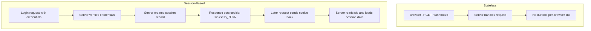

```mermaid
flowchart TD
  subgraph A[Stateless]
    A1["Browser -> GET /dashboard"] --> A2["Server handles request"]
    A2 --> A3["No durable per-browser link"]
  end

  subgraph B[Session-Based]
    B1["Login request with credentials"] --> B2["Server verifies credentials"]
    B2 --> B3["Server creates session record"]
    B3 --> B4["Response sets cookie: sid=sess_7F3A"]
    B4 --> B5["Later request sends cookie back"]
    B5 --> B6["Server reads sid and loads session data"]
  end
```
