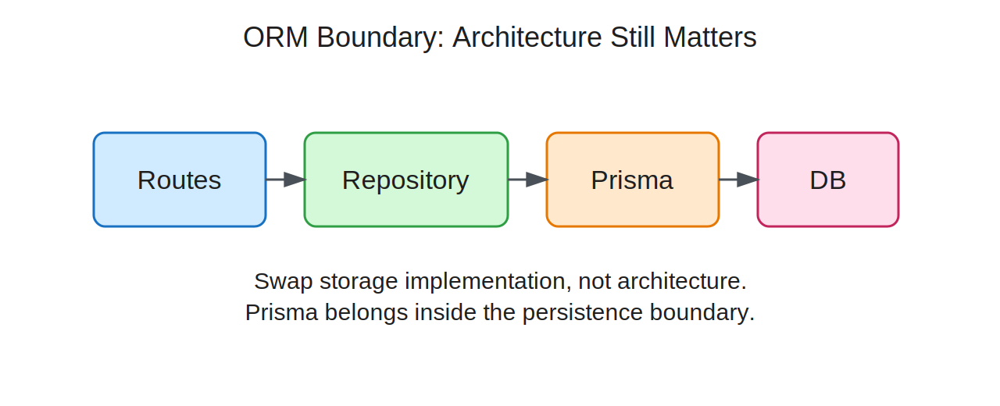

<style>
@import "./styles/main.css";
@import "./styles/styles.css";
</style>

# Identity, Credentials, and Session Establishment

## COMPSCI 326 Web Programming

<div class="text-2xl opacity-70 mt-6">
Lecture 6.11: Identity and Sessions
</div>

---
layout: two-cols-header
class: text-2xl community-agreement
---

## Community Agreement

::left::

- **Attend & Engage:** Show up every class and be fully present - learning improves when we participate together.
- **Stay Focused:** No devices in class (unless asked); laptops and phones pull attention away from you and others.
- **Use AI Responsibly:** AI tools are allowed when used transparently and to support, not replace, your own thinking.

::right::

- **Learn with a Growth Mindset:** Mistakes and questions are part of the process, ask early and often.
- **Respect & Include Everyone:** Value diverse experiences, assume positive intent, and maintain a safe space for questions.
- **Support Each Other:** Collaborate to help peers understand, not just finish work; listen generously.

---
class: text-2xl
---

## Agenda

- Connect to persistence and ORM boundaries
- Explain why HTTP alone does not give user continuity
- Build the session mental model from browser to server
- Practice with two paper-and-pencil activities
- Bridge to authentication and authorization

**Outcome:** you can explain how a browser and server maintain continuity across requests.

---
layout: two-cols
class: text-2xl cols-60-40
---

## Connection to Last Lecture

- Last time, persistence lived behind a repository boundary.
- The database became the durable source of truth.
- Today, we move up one layer to the HTTP/application boundary.

<div class="callout">
Sessions are not a database replacement. They are a continuity mechanism between browser requests.
</div>

::right::



---
class: text-2xl
---

## Why Sessions Exist

- Users expect continuity across requests.
- Multi-step workflows need state that survives more than one route.
- Personalization depends on remembering something about this browser.
- A successful login would be useless if the next request forgot it immediately.

---
layout: two-cols-header
class: text-2xl cols-50-50
---

## What HTTP Does Not Give Us

::left::

- HTTP is stateless by default.
- Each request arrives as a separate event.
- Server process memory alone is not enough for browser-specific continuity.

<br>

<div class="callout callout-warn">
If two requests look identical, HTTP itself does not tell the server whether they came from the same browser.
</div>

::right::

```text
Request 1  --->  server handles it  ---> done
Request 2  --->  server handles it  ---> done

No built-in memory link
between request 1 and request 2
```

---
layout: two-cols
class: text-xl cols-75-25
---

## Stateless vs Session-Based Request Flow

<div class="callout">
The browser stores a small token. The server stores the session data. The token links them.
</div>

::right::

<ul class="ul-frame">
  <li>Browser can store a cookie.</li>
  <li>Cookie should carry an opaque session id.</li>
  <li>Server uses that id to look up session state.</li>
  <li>Continuity fails when those pieces do not match.</li>
</ul>

---
class: text-xl
---

## Stateless vs Session-Based Request Flow


---
layout: two-cols-header
layoutClass: title-tight cols-60-40
---

## In-Class Activity 1: Continuity Channel Puzzle

::left::

Consider the following browser/server interaction over HTTP:

```text
Shared sequence

1. Browser -> POST /login with credentials
2. Server verifies credentials
3. Server creates session record:
       key = "sess_7F3A"
       value = { userId: 42, role: "student" }
4. Server response includes the following header:
   Set-Cookie: sid = __________
5. Browser stores that cookie
6. Later browser request sends:
   Cookie: userId = 42          <-- one step is wrong
7. Server tries to look up the session id:
   sessionStore[ __________ ]
8. If lookup succeeds, server knows this is 
   the same browser
```

::right::

<CountdownTimer
  label="Activity 1"
  :minutes="8"
  :auto-start="true"
  :warn-at="30"
/>

<div class="text-sm">

**Write down:**
- the correct cookie value in step 4
- the correct lookup key in step 7
- the exact step number that is broken
- one sentence explaining why it breaks continuity

</div>

**Facts you may use:**
<ul class="ul-frame text-sm">
  <li>HTTP is stateless unless the app creates a continuity channel.</li>
  <li>The browser sends the cookie back on later requests.</li>
  <li>The cookie should hold the session id, not the full user state.</li>
  <li>The server looks up session data by that session id.</li>
</ul>

---
class: text-2xl
---

## Discussion Point

<CourseCallout title="Key Idea">
We can keep continuity data in the browser, on the server, or split between both. How do we create a continuous browser-server channel so each new request can tell one browser apart from another?
</CourseCallout>

<CountdownTimer
  label="Activity 1"
  :minutes="5"
  :auto-start="true"
  :warn-at="30"
/>

**Discuss in small groups:**

- What should the browser send each request?
- What should the server store?
- What tradeoffs come from that split?

---
layout: two-cols-header
class: text-xl cols-60-40
---

## Identity, Credentials, and Session

::left::

- **Identity:** who the system believes this is
- **Credentials:** proof presented by the client
- **Session:** server-established continuity after verification

<div class="callout">
Today is about session establishment and use, not full authentication policy.
</div>

::right::

```text
[ Credentials ] ---> [ Verification ] ---> [ Session ]
   password             compare hash         store session state
   login code           check user record    send session cookie

   "Who are you?"       "Is that true?"      "Stay signed in"
```

---
class: text-2xl
---

## Core Session Lifecycle

```text
Browser                          Server
-------                          -----------------------------
credentials   ------------->     verification
(password, token)                check database / hash / rules

session cookie <-------------    create session
later requests ------------->    look up session and restore identity

```

<br>

- Establish after a successful identity check
- Attach the session id to the client, usually with a cookie
- Reuse and update session data on later requests
- End the session explicitly or by expiration

---
class: text-2xl framed-lists
---

## Session ID and Cookie Basics

```http
HTTP/1.1 200 OK
Set-Cookie: sid=sess_7F3A; HttpOnly; Secure; SameSite=Lax
Content-Type: text/html
```

```http
GET /dashboard HTTP/1.1
Cookie: sid=sess_7F3A
```

<br>

- `sid` is an opaque token, not user data.
- `HttpOnly` helps block JavaScript access.
- `Secure` means send only over HTTPS.
- `SameSite` helps reduce cross-site request risk.

---
layout: two-cols-header
class: text-xl cols-50-50
layoutClass: title-tight framed-lists
---

## Express Session Conceptual Setup

::left::

```ts
import express from "express";
import session from "express-session";

const app = express();

app.use(session({
  secret: process.env.SESSION_SECRET!,
  resave: false,
  saveUninitialized: false,
  cookie: {
    httpOnly: true,
    sameSite: "lax",
    secure: false,
  },
}));
```

::right::

<ul class="ul-frame">
  <li>This middleware turns on session support for the app.</li>
  <li>The server uses a secret value to protect the session cookie from tampering.</li>
  <li>It avoids saving sessions when nothing changed or when no real session data exists yet.</li>
  <li>The cookie is marked <code>httpOnly</code> so browser JavaScript cannot read it.</li>
  <li><code>sameSite: "lax"</code> helps reduce cross-site request abuse.</li>
  <li><code>secure: false</code> is acceptable for local development, but production should use HTTPS-only cookies.</li>
</ul>


---
class: text-xl
---

## Express Session Minimal Example

```ts {1-7|9-13|14-19|all}
app.get("/login-demo", (req, res) => {
  req.session.user = {
    id: 42,
    role: "student",
  };
  res.send("session established");
});

app.get("/dashboard", (req, res) => {
  const role = req.session.user?.role ?? "guest";
  res.send(`current role: ${role}`);
});

app.post("/logout", (req, res) => {
  req.session.destroy(() => {
    res.send("logged out");
  });
});
```

<div class="text-2xl leading-relaxed" v-if="$clicks === 0">
  <p><strong>Block 1:</strong> one route creates session state after a successful event.</p>
</div>

<div class="text-2xl leading-relaxed" v-else-if="$clicks === 1">
  <p><strong>Block 2:</strong> a later route reads session state and changes behavior.</p>
</div>

<div class="text-2xl leading-relaxed" v-else-if="$clicks === 2">
  <p><strong>Block 3:</strong> logout invalidates the session instead of leaving it alive forever.</p>
</div>

<div class="text-2xl leading-relaxed" v-else>
  <p><strong>Key idea:</strong> session state sits at the HTTP/application layer and affects later requests.</p>
</div>

---
layout: two-cols
class: text-2xl cols-60-40
---

## Session Store Choices

- Memory store is acceptable for learning and quick local demos.
- Real deployments need a store that survives restart and can be shared.
- Multi-instance deployments break if each server keeps isolated session memory.

<div class="callout callout-warn">
If the store disappears on restart, the session disappears too.
</div>

::right::

```text
[ One Server + Memory Store ]
------------------------------
  restart => sessions lost

[ Two Servers + Separate Memory Stores ]
-----------------------------------------
  request may hit server A or server B
  same cookie, different session memory
```

---
layout: two-cols
class: text-2xl cols-60-40
---

## Session Correctness and Security Fundamentals

1. **Regenerate sessions** on sensitive transitions such as login.
2. **Do not store** raw credentials in the session.
3. **Use expiration** and **explicit logout**.

<div class="callout">
Before the next activity, keep three cause-and-effect rules in mind.
</div>

::right::

<ul class="ul-frame">
  <li>Logged out after restart: session was only in memory.</li>
  <li>Works on one server only: servers are not sharing session storage.</li>
  <li>Password in session: storing sensitive data you should not keep.</li>
</ul>

---
layout: two-cols-header
class: text-xl exercise-compact cols-67-33
layoutClass: title-ultra-tight
---

## In-Class Activity 2: Session Failure Detective

::left::

Everyone solves the same scenario on paper in small groups.

```text
BROKEN SYSTEM DESCRIPTION
- A user logs in successfully.
- After the server restarts, the user is logged out.
- On a two-server deployment, server A recognizes the session
  but server B does not.
- The session object stores the user's raw password.

EXAMPLE:
Problem: Users stay logged in forever.
Design flaw: The session never expires.
Fix: Add an expiration time so old sessions are 
     removed automatically.

```

Write down for each problem:

1. What is wrong in the design
2. One sentence explaining how to fix it
3. Which problem is the most dangerous, and why

::right::

<div class="sticky-note">
Facts you may use
</div>

<ul class="ul-frame">
  <li>Memory store is for dev only and is lost on restart.</li>
  <li>Multi-instance apps need a shared session store.</li>
  <li>Sessions should store minimal necessary state, not raw credentials.</li>
</ul>

<CountdownTimer
  label="Activity 1"
  :minutes="8"
  :auto-start="true"
  :warn-at="30"
/>

<!--
Solution:

Broken system description:

- "A user logs in successfully."
  This tells us the initial login and session creation path works.

- "After the server restarts, the user is logged out."
  Cause: session data is stored only in server memory, so restart wipes it out.
  Fix: move session storage to a durable store such as Redis or a database-backed session store.

- "On a two-server deployment, server A recognizes the session but server B does not."
  Cause: each server has its own separate session store, so they do not see the same session record.
  Fix: use one shared session store that all app instances read and write.

- "The session object stores the user's raw password."
  Cause: the session contains highly sensitive data that should never be kept there.
  Fix: store only minimal session state such as user id and role, never raw credentials.

Most dangerous flaw:
The raw password in the session is the most dangerous because it increases the harm of session leakage or server compromise and violates data minimization.
-->

---
class: text-2xl
---

## Activity Debrief

- What clues pointed to each failure cause?
- Which fixes improved correctness?
- Which fixes improved security?
- How did store choice and lifecycle rules explain the whole scenario?

<div class="callout">
The point is not memorizing one library. The point is recognizing the design pattern and its failure modes.
</div>

---
layout: two-cols-header
class: text-2xl cols-50-50
---

## How This Prepares Next Lecture

::left::

- **Today:** establish continuity after verification.
- **Next lecture:** prove identity and enforce access control.
- *Authentication* and *authorization* depend on correct session handling.

<div class="callout">
If session state is wrong, later authorization decisions are wrong too.
</div>

::right::

```text
credentials -> verify -> establish session
session -> use on later requests
later lecture -> decide what this user may do
```

---
class: text-2xl
---

## Wrap-Up Summary

- HTTP does not provide user continuity by itself.
- Sessions create continuity by linking a browser-held token to server-held state.
- Session lifecycle, store choice, and cookie settings affect correctness and risk.
- Express exposes this through middleware and <code>req.session</code>.

---
class: text-2xl
---

## Conclusion and Next Steps

- Review today’s request flow and two activity solutions.
- Be ready to distinguish identity, credentials, and session.

<CourseCallout title="Main Takeaway">
Sessions are an application-layer design for continuity across stateless HTTP requests.
</CourseCallout>
