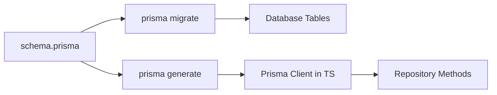

<style>
@import "./styles/main.css";
@import "./styles/styles.css";
</style>

# ORM and Prisma

## COMPSCI 326 Web Programming

<div class="text-2xl opacity-70 mt-6">
Lecture 6.10: Object-Relational Mapping
</div>

<!--
Presenter + Student Notes

Teaching goal:
Set the topic and pacing expectations.

Say this clearly:
Today is the sequel to persistence: same architecture, better tooling.

Student takeaway:
Prisma helps us implement persistence with less accidental pain.
-->

---
layout: two-cols-header
class: text-2xl community-agreement
---

# Community Agreement

::left::

- **Attend & Engage:** Show up every class and be fully present.
- **Stay Focused:** No devices unless we need them for an activity.
- **Use AI Responsibly:** AI is allowed when used transparently.

::right::

- **Learn with a Growth Mindset:** Ask early, ask often.
- **Respect & Include Everyone:** Make room for different backgrounds.
- **Support Each Other:** Help peers understand, not just finish.

---
class: text-2xl
---

# Agenda

- Connect to last lecture (persistence boundaries)
- What an ORM is and why teams use one
- Prisma fundamentals in our stack
- In-class design activity
- Wrap-up: what to carry into homework and exam prep

**Target Outcome:** explain how Prisma helps, where it belongs, and where it does *not* replace thinking.

---
class: text-2xl
---

# Quick Connection to Last Lecture

Last time, we said:

- Memory is temporary
- Canonical data must survive restart
- Repositories protect boundaries

Today we add:

- A tool that maps objects to relational tables
- A safer workflow for schema + queries

<p class="reading-connection">Same architecture. New implementation layer.</p>

---
class: text-2xl
---

# The Problem ORMs Try to Solve

Without an ORM, you often write:

- SQL strings by hand
- manual row-to-object mapping
- repeated validation and type conversion

That works, but it gets noisy fast.

Also, one typo in SQL at 1:12 AM can become a personality test.

---
class: text-2xl
---

# What Is an ORM?

**Object-Relational Mapping (ORM)** = a layer that:

- maps database rows to app objects
- builds SQL for common operations
- gives you one API for create/read/update/delete

Think: translator between your app's object world and your database's table world.

---
class: text-2xl
layout: two-cols
---

# Why Teams Use ORMs

- Faster feature development
- Less repeated SQL boilerplate
- Better type safety (with modern ORMs)
- Easier refactors when schema changes

::right::

# Tradeoffs

- You still need SQL knowledge
- Bad queries are still possible
- "Works in dev" can still fail in production
- Abstractions can hide performance details

---
class: text-2xl
---

# Prisma in One Sentence

Prisma is a TypeScript-first ORM toolkit that gives you:

- a schema file for data models
- migrations to evolve tables
- a generated client for typed database queries

You describe data once, then use generated code with auto-complete and type checks.

---
class: text-xl
---

# Prisma Workflow (Big Picture)



Small loop, repeated often: edit schema -> migrate -> generate -> code.

---
class: text-xl
---

# `schema.prisma` Fundamentals

```prisma {1-2|4-9|11-23}
generator client {
  provider = "prisma-client-js"
}

datasource db {
  provider = "sqlite"
  url      = env("DATABASE_URL")
}

model User {
  id        Int      @id @default(autoincrement())
  email     String   @unique
  name      String?
  posts     Post[]
  createdAt DateTime @default(now())
}

model Post {
  id        Int      @id @default(autoincrement())
  title     String
  body      String
  authorId  Int
  author    User     @relation(fields: [authorId], references: [id])
}
```

---
class: text-xl
---

# From SQL Thinking to Prisma Thinking

````md magic-move
```sql
-- "Get recent posts with author email"
SELECT p.id, p.title, u.email
FROM Post p
JOIN User u ON p.authorId = u.id
ORDER BY p.id DESC
LIMIT 5;
```
```ts
const posts = await prisma.post.findMany({
  orderBy: { id: "desc" },
  take: 5,
  select: {
    id: true,
    title: true,
    author: { select: { email: true } },
  },
});
```
````

---
class: text-xl
---

# Prisma Client Basics

```ts {1|3-8|10-17}
import { PrismaClient } from "@prisma/client";

const prisma = new PrismaClient();

const user = await prisma.user.create({
  data: { email: "a@school.edu", name: "Avery" },
});

const posts = await prisma.post.findMany({
  where: { authorId: user.id },
  orderBy: { createdAt: "desc" },
  take: 10,
});

await prisma.$disconnect();
```

---
class: text-xl
---

# Keep the Repository Boundary

```ts {1-2|4-11|13-22}
import { PrismaClient, Post } from "@prisma/client";

export class PrismaPostRepository {
  constructor(private readonly prisma: PrismaClient) {}

  async create(title: string, body: string, authorId: number): Promise<Post> {
    return this.prisma.post.create({
      data: { title, body, authorId },
    });
  }

  async listByAuthor(authorId: number): Promise<Post[]> {
    return this.prisma.post.findMany({
      where: { authorId },
      orderBy: { id: "desc" },
    });
  }
}
```

Tooling changed. Boundary did not.

---
class: text-xl
---

# Migrations: Why They Matter

```bash
npx prisma migrate dev --name add-post-tags
npx prisma generate
```

Migrations give you:

- versioned schema changes
- repeatable team workflow
- less "it works on my machine" drama

If your DB schema is a shared contract, migrations are the change log.

---
class: text-xl
---

# Handling Common Errors

```ts {1-4|6-11}
try {
  await prisma.user.create({ data: { email: "a@school.edu" } });
} catch (error: any) {
  if (error.code === "P2002") {
    // unique constraint failed (duplicate email)
    throw new Error("Email already exists");
  }

  throw error;
}
```

Translate ORM/database errors into user-safe messages.

---
class: text-xl
---

# Transactions for "All-or-Nothing"

```ts {1|3-18}
import { PrismaClient } from "@prisma/client";

await prisma.$transaction(async (tx) => {
  const post = await tx.post.create({
    data: { title: "ORMs are cool", body: "Mostly.", authorId: 1 },
  });

  await tx.auditLog.create({
    data: {
      action: "POST_CREATED",
      entityId: post.id,
      message: "Post created and logged",
    },
  });
});
```

If one step fails, nothing commits. Clean state wins.

---
class: text-2xl framed-lists-green
layout: two-cols-header
layoutClass: cols-50-50 title-tight exercise-compact
---

::left::

### In-Class Activity

**Prisma Boundary Drill**

Pick **1 scenario** and fill in the design blanks:

- A) Student updates profile name
- B) User adds item to cart
- C) Team member marks task complete
- D) Admin archives a project

For your chosen scenario, produce:

1. Prisma model fields involved
2. Repository method signature
3. One migration change (if needed)
4. One failure risk
5. One restart-style verification test

::right::

<div class="callout">
Goal: keep the persistence boundary clear while using Prisma correctly.
</div>

<div class="sticky-note text-base">

<strong>Example (A: Update profile name)</strong>
1. Model fields: <code>User.id</code>, <code>User.name</code>
2. Method: <code>updateName(userId: number, name: string)</code>
3. Migration: none (field already exists)
4. Failure risk: write succeeds, but response times out
5. Test: update name -> restart server -> read user -> name is updated

</div>

---
class: text-2xl
---

# Debrief Checklist

When groups report out, listen for:

- Did they name concrete model fields?
- Is the repository method minimal and clear?
- Did they identify a realistic failure moment?
- Does their test prove persistence after restart?

Good answers are specific. Vague answers are usually hiding missing design work.

---
class: text-2xl
---

# Story Ending: What Changed Today?

From last lecture to now:

- We kept persistence architecture
- We added ORM tooling (Prisma)
- We improved speed and type safety
- We did **not** outsource system thinking to a library

Prisma is a power tool, not a substitute for good boundaries.

---
class: text-2xl
---

# What to Internalize

- ORMs reduce accidental complexity, not essential complexity.
- Prisma schema + migrations + client form one workflow.
- Repository boundaries still make testing and reasoning easier.
- Clear data models beat clever hacks every time.

If future-you can read your repository methods without squinting, present-you did great.

---
class: text-2xl
---

# Next Step

- Read the ORM/Prisma guide in course notes
- Re-implement one repository from JSON -> Prisma
- Write one restart-style test for the Prisma version

Next lecture: query patterns, filtering, and pagination with Prisma.
