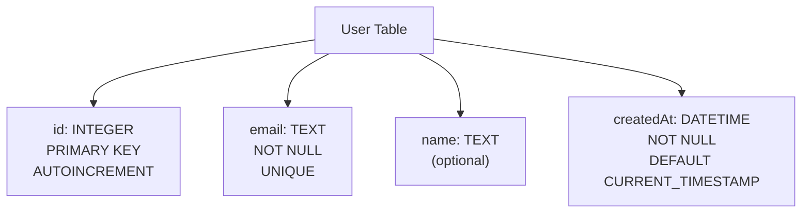
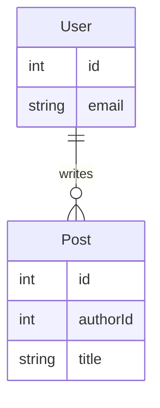

# 10 ORM and Prisma

This is the primary reading for Lecture 6.10 in COMPSCI 326 Web Programming. In Lecture 6.9, you learned that persistence is about protecting canonical state across restart, failure, and concurrency. In this lecture, we keep that architectural model and introduce a practical tool that helps us implement it in a cleaner and safer way: Prisma, which is an ORM.

This chapter is written for those who may have never taken a database class before. That means we are going to start from first principles and build up carefully. You should not feel pressure to "already know" words like relation, schema, query, or SQL. By the end of this reading, those words should feel normal, concrete, and useful.

If you remember one sentence from this chapter, remember this: Prisma is a tool that helps your code talk to a relational database, but good architecture and clear thinking still do the most important work.

## 1. Why We Need a New Layer After Persistence

In Lecture 6.9, we proved a hard but useful truth: memory inside a running process is temporary, and user expectations are not. Your app can restart, your server can crash, your laptop can sleep, and your data still needs to be there when the user comes back. That lecture gave you the architecture discipline for persistence boundaries. This lecture does not replace that discipline. It extends it.

When you first begin persistence work, they often write one of two kinds of code. They either keep data in in-memory variables and accidentally lose it on restart, or they write file and SQL logic directly in route handlers and gradually create tangled code that becomes hard to test. Both paths are common. Neither is a moral failure. They are simply normal first steps.

What we need now is a way to keep the good architecture from 6.9 while reducing accidental complexity in implementation. That is where relational databases and ORMs enter the story.

## 2. What Is a Database, in Plain Language

A database is a system for storing and retrieving data over time in a reliable way. That definition sounds simple, but it contains a lot of engineering work. A database system is not just a file with bytes. It includes rules for structure, methods for lookup, mechanisms for handling concurrent access, and tools for preserving correctness as data grows.

When you use a database, you are choosing to delegate important responsibilities to software that is built specifically for data management. Instead of implementing your own ad hoc data rules in random places, you use a storage engine that was designed for exactly this job. In web applications, this matters because many users and many requests can interact with the same data at nearly the same time.

## 3. What Is a Relational Database

A relational database is a kind of database that stores data in a structured, table-based form and connects pieces of data through relationships. The word relational comes from mathematics, but in application development you can think of it as "data that is organized into related sets with clear rules."

In a relational system, data is usually organized as tables. A table has columns that describe the kind of data each field holds, and rows that represent individual records. For example, a `User` table might have columns like `id`, `email`, and `name`, and each row would represent one user.

Relational databases became widely used because they provide a strong balance of clarity and power. They are explicit enough for beginners to reason about and powerful enough for large systems with complex data rules.

## 4. A Short History: Where This Came From

Relational databases did not appear as a trendy new framework. They emerged from a long-running software pain point: teams could store data, but as systems grew, that data became difficult to understand, difficult to update safely, and difficult to share across different applications. In many early systems, data access was tightly tied to custom storage paths and low-level application logic. This made maintenance expensive and risky, because small changes in one area could break unrelated parts of the system.

In 1970, Edgar F. Codd published a paper at IBM describing the relational model of data. His proposal was simple in spirit but powerful in effect. Instead of navigating data through app-specific pointer structures, developers could represent data in well-defined relations and query it with a formal language. That shift gave teams a way to reason about data shape and data operations more clearly, and it created a shared foundation that could be reused across projects and organizations.

During the 1970s and 1980s, the relational model moved from research into real products. Early systems and research projects helped establish SQL as the practical query language, and commercial platforms made relational storage broadly available to companies building business software. Over time, relational databases became a default for many applications because they balanced structure, correctness, and flexibility better than many ad hoc alternatives.

**Short timeline**

> **1960s:** Many systems use application-specific, tightly coupled data access patterns.  
> **1970:** E. F. Codd publishes the relational model paper at IBM.  
> **1970s:** Research and prototypes explore relational query and optimization ideas.  
> **1980s:** Commercial relational database products become widely adopted.  
> **1990s-present:** Relational databases remain foundational in business and web systems.

If you are seeing this for the first time, do not worry about memorizing every year. The key point is that relational databases were invented to solve real engineering problems in maintainability and correctness, not to add academic vocabulary.

## 5. Why Relational Databases Were Invented

Before relational systems became standard, teams often built storage layers that were deeply tied to one program's internal structure. This meant the "map" of data lived inside code details, not in a shared, stable model. As a result, changing one feature could require rewriting low-level data handling in several places. New engineers had to learn many local conventions before they could safely modify anything. Data sharing between tools was harder, and long-term maintenance costs climbed quickly.

Relational design addressed this by separating data definition from application-specific navigation logic. Teams could define a schema as a stable contract, express relationships explicitly, and query data by intent. That changed everyday development work. Instead of writing one-off data traversal code each time, developers could ask structured questions with SQL and rely on the database engine to perform the retrieval safely and efficiently.

The result was not "perfect software forever," but a major improvement in clarity and long-term evolvability. In practical terms, relational systems gave teams a cleaner agreement between data and code.

### Before vs After Relational Design

| Dimension                   | Before Relational (Typical)               | After Relational (Typical)                        |
| --------------------------- | ----------------------------------------- | ------------------------------------------------- |
| Data structure              | App-specific formats tied to one codebase | Shared schema with explicit tables and columns    |
| Access style                | Custom traversal logic per feature        | Standardized SQL queries                          |
| Relationship handling       | Often implicit in code paths              | Explicit via keys and relations                   |
| Change cost                 | High, because storage logic is scattered  | Lower, because schema and queries are centralized |
| Team onboarding             | Slow, many local conventions to learn     | Faster, common relational vocabulary              |
| Cross-tool interoperability | Difficult                                 | Easier through standard query model               |

## 6. The Core Vocabulary You Need First

Before we talk about Prisma, we need a clean vocabulary base. Each term below will appear repeatedly in this chapter and in lecture.

A table is a named collection of records that all follow the same column structure. A column is one field definition in a table, like `email` or `createdAt`. A row is one actual record value in that table, such as one specific user.

A schema is the formal definition of how data is organized: what tables exist, what columns each table has, what data types are allowed, and what constraints and relationships must hold. A query is a request for data operations, such as reading, inserting, updating, or deleting records. SQL is the standard language used to write those queries for relational databases.

If this feels like a lot of words at once, that is normal. The goal is repetition with meaning. By the time you reach the Prisma sections, these terms will feel familiar.

## 7. What a Table Really Means

You often first hear "table" and imagine a spreadsheet. That comparison is useful for orientation, but it is incomplete. A database table is not only a visual grid. It is a structured set with rules. Each row must respect column types and constraints, and the system can enforce relationships to other tables.

For example, in a table named `User`, one row might represent a student account. Another row represents a different account. The table is not just storing text values. It is storing records that your app depends on as canonical state.

When you model your app, the question is not "how many tables can I make." The better question is "what entities in my domain need stable identity and clear rules." That question leads to better schema design.

Example table shape:

```text
Table: User
+----+----------------------+-------------+
| id | email                | name        |
+----+----------------------+-------------+
| 1  | ava@school.edu       | Ava         |
| 2  | ben@school.edu       | Ben         |
+----+----------------------+-------------+
```

## 8. Columns, Types, and Constraints

A column is more than a heading label. It is a contract about what values are valid. If a column is declared as `Int`, that signals a different kind of expectation than a `String` column. If a column is marked unique, that expresses an invariant such as "no two users should share the same email address."

These constraints matter because they move correctness checks closer to the data itself. Application validation is still important for user-friendly errors, but database constraints provide a harder safety net. When both layers are used together, systems are safer and easier to reason about.

This is also where architecture from 6.9 still matters. Constraints belong to persistence correctness, and persistence correctness belongs inside a clear boundary.

Example SQL table definition with column types and constraints:

```sql
CREATE TABLE User (
  id INTEGER PRIMARY KEY AUTOINCREMENT,
  email TEXT NOT NULL UNIQUE,
  name TEXT,
  createdAt DATETIME NOT NULL DEFAULT CURRENT_TIMESTAMP
);
```

Diagram of the table structure created by that statement:



This one statement quietly does a great deal of design work for us. It creates a table named `User` and gives every row a stable identity through the `id` column, which is marked as a primary key and automatically increments so we do not have to invent IDs by hand. It requires every user to have an `email`, and it also enforces that each email appears only once, which protects us from duplicate-account mistakes at the database level rather than relying only on route-level checks. It allows `name` to be optional, which matches the reality that some profile fields may be missing at first. Finally, it guarantees that every row has a `createdAt` timestamp and, when we do not provide one explicitly, the database fills in the current time for us. In simple terms, this definition is not just storage syntax; it is a compact contract about identity, required data, uniqueness, optional fields, and default behavior.

## 9. Rows and Identity

A row is one record instance in a table. Rows are usually identified by a primary key column, often named `id`. Identity matters because records need stable references over time. Without stable identity, updates and relationships become fragile.

In beginner projects, you sometimes treat row position as identity, or rely on mutable fields as lookup keys. That causes pain quickly. The right pattern is to use explicit identifiers and keep them stable. This is one reason you will see `@id` and default ID generation in Prisma schema files.

Once identity is explicit, relationships become clear and robust.

Example row-level operations using identity:

```sql
INSERT INTO User (email, name) VALUES ('ava@school.edu', 'Ava');
SELECT id, email, name FROM User WHERE id = 1;
UPDATE User SET name = 'Ava Li' WHERE id = 1;
```

Diagram: table state before and after `INSERT`, then before and after `UPDATE`:

```text
Before INSERT
+----+-------+------+
| id | email | name |
+----+-------+------+
|    (empty table)  |
+----+-------+------+

After INSERT
+----+----------------+------+
| id | email          | name |
+----+----------------+------+
| 1  | ava@school.edu | Ava  |
+----+----------------+------+
```

```text
Before UPDATE (same row loaded by id = 1)
+----+----------------+------+
| id | email          | name |
+----+----------------+------+
| 1  | ava@school.edu | Ava  |
+----+----------------+------+

After UPDATE
+----+----------------+--------+
| id | email          | name   |
+----+----------------+--------+
| 1  | ava@school.edu | Ava Li |
+----+----------------+--------+
```

These three statements show a complete mini life cycle for one row. The `INSERT` creates a new user record by providing values for `email` and `name`; because `id` is auto-incremented, the database assigns identity for us automatically. The `SELECT` then reads the row back using `WHERE id = 1`, which demonstrates why stable primary keys matter: we can ask for exactly one specific record instead of guessing by position or display order. The `UPDATE` changes only the `name` field for that same identified row, leaving the rest of the row intact. In plain language, this sequence demonstrates the practical meaning of identity in a relational system: create a record, find it reliably by its key, and modify it safely without affecting unrelated records.

### Identity, IDs, and Referencing

The importance of IDs goes far beyond one SQL statement. In data systems generally, an ID is the anchor that makes one record reliably addressable over time, even when other fields change. Names can change, emails can be corrected, titles can be edited, but a stable ID lets the system keep pointing to the same underlying record. In relational databases, IDs are the bridge that makes relations safe: one table can reference another table's primary key and know exactly which row it means. In web applications, this same idea appears everywhere. Links often carry IDs in paths, such as `/users/1` or `/posts/10/edit`, and route handlers use that ID to load the exact record needed for display or update. A page that lists posts might render each post title as a link containing the post ID, and when the user clicks it, the server reads that route parameter and runs a lookup query like `WHERE id = ...`. This is why ID design is not a minor implementation detail. It is foundational to reliable referencing across database rows, API endpoints, URLs, and user-facing navigation.

## 10. What a Relation Is

A relation describes how records in one table connect to records in another table. A very common example is one-to-many: one user can have many posts. In that model, each post row includes a reference to its author's user ID.

These references are typically expressed with foreign keys. A foreign key means "this value must correspond to a valid row in another table." That rule prevents orphaned or inconsistent records. It also gives your application a reliable structure for traversing connected data.

If you are new to this, think of relations as explicit links between records. They are what make a relational database relational.



What you are looking at is an entity-relationship (ER) view of two tables and the rule that connects them. The `User` box represents one table and shows a few key fields (`id`, `email`). The `Post` box represents a second table and shows fields including `authorId`, which is the linking field. The connector `User ||--o{ Post : writes` is a compact way of saying "one user can be related to many posts." In plain language, one user record may have zero, one, or many post records, but each post points back to one author. That is the relationship your application depends on when it shows "posts by this user" or "author of this post."

This is important to diagram because relations are where many data bugs are born. Without a clear picture, teams often confuse which side is one-to-many, forget which column is the foreign key, or accidentally design data flows that allow orphaned records. A small diagram forces shared understanding before code grows. You should care because this affects real application behavior immediately: route handlers, joins, API responses, delete rules, and UI links all rely on this relationship being understood correctly. If the relation is modeled clearly, queries and features become easier to write and debug; if it is modeled vaguely, every new feature becomes harder than it should be.

## 11. What a Query Is

A query is a request to the database to perform an operation on data. Queries can ask for data, insert new data, update existing data, or remove data. The key point is that queries are intentional requests with defined structure and behavior.

In practice, web apps send many queries over time as users interact with forms, buttons, search fields, and dashboards. Good query design matters for both correctness and performance. Even in beginner apps, clarity about query intent reduces bugs.

When we introduce Prisma, we are not removing queries. We are changing how we write them in application code.

Common query categories:

```sql
-- Read
SELECT * FROM Post WHERE authorId = 1;

-- Insert
INSERT INTO Post (title, body, authorId) VALUES ('Hello', 'Body', 1);

-- Update
UPDATE Post SET title = 'Updated' WHERE id = 10;

-- Delete
DELETE FROM Post WHERE id = 10;
```

To make these queries concrete, use this reference table as starting data:

```text
Reference Table: Post (before any example query runs)
+----+--------------------+------------------+----------+
| id | title              | body             | authorId |
+----+--------------------+------------------+----------+
| 10 | Intro to SQL       | Basics of SQL    | 1        |
| 11 | ORM Overview       | Why ORMs exist   | 1        |
| 12 | CSS Notes          | Styling tips     | 2        |
+----+--------------------+------------------+----------+
```

### Read Query (`SELECT`)

```sql
SELECT * FROM Post WHERE authorId = 1;
```

This query asks the database to return all columns for rows where `authorId` is exactly `1`. In other words, it filters the `Post` table down to posts written by one author. The result includes rows `10` and `11` because both rows match the condition `authorId = 1`, while row `12` is excluded because its `authorId` is `2`.

```text
Result of SELECT * FROM Post WHERE authorId = 1
+----+--------------------+----------------+----------+
| id | title              | body           | authorId |
+----+--------------------+----------------+----------+
| 10 | Intro to SQL       | Basics of SQL  | 1        |
| 11 | ORM Overview       | Why ORMs exist | 1        |
+----+--------------------+----------------+----------+
```

### Insert Query (`INSERT`)

```sql
INSERT INTO Post (title, body, authorId) VALUES ('Hello', 'Body', 1);
```

This query creates a new row in the `Post` table by supplying values for `title`, `body`, and `authorId`. The database assigns `id` automatically when `id` is configured as an auto-incrementing primary key. The key idea is that `INSERT` changes table state by adding one new record, not by changing existing rows.

```text
Post table after INSERT
+----+--------------------+------------------+----------+
| id | title              | body             | authorId |
+----+--------------------+------------------+----------+
| 10 | Intro to SQL       | Basics of SQL    | 1        |
| 11 | ORM Overview       | Why ORMs exist   | 1        |
| 12 | CSS Notes          | Styling tips     | 2        |
| 13 | Hello              | Body             | 1        |
+----+--------------------+------------------+----------+
```

### Update Query (`UPDATE`)

```sql
UPDATE Post SET title = 'Updated' WHERE id = 10;
```

This query modifies existing rows that match the `WHERE` condition. Here, only row `id = 10` is updated, so only its `title` changes. Every other row stays exactly the same. The `WHERE` clause is the safety mechanism that prevents accidental bulk updates.

```text
Post table after UPDATE Post SET title = 'Updated' WHERE id = 10
+----+--------------------+------------------+----------+
| id | title              | body             | authorId |
+----+--------------------+------------------+----------+
| 10 | Updated            | Basics of SQL    | 1        |
| 11 | ORM Overview       | Why ORMs exist   | 1        |
| 12 | CSS Notes          | Styling tips     | 2        |
+----+--------------------+------------------+----------+
```

### Delete Query (`DELETE`)

```sql
DELETE FROM Post WHERE id = 10;
```

This query removes rows that match the `WHERE` condition. Because `id` is a unique key, `WHERE id = 10` matches exactly one row, so one row is deleted. If the condition matched multiple rows, multiple rows would be removed. This is why delete queries should always be written and reviewed carefully.

```text
Post table after DELETE FROM Post WHERE id = 10
+----+--------------------+------------------+----------+
| id | title              | body             | authorId |
+----+--------------------+------------------+----------+
| 11 | ORM Overview       | Why ORMs exist   | 1        |
| 12 | CSS Notes          | Styling tips     | 2        |
+----+--------------------+------------------+----------+
```

## 12. What SQL Is

SQL stands for Structured Query Language. It is the standard language for relational data operations. You do not need to become a SQL expert in one day, but you should understand what SQL is doing conceptually.

A simple SQL query can read rows from a table and choose which columns to return. More advanced SQL can join related tables, sort results, aggregate data, and enforce updates with conditions. SQL has lasted for decades because it expresses data intent clearly and works across many relational systems.

Prisma still produces SQL under the hood. That means SQL knowledge remains valuable even when you use ORM tooling.

A beginner SQL example with common clauses:

```sql
SELECT p.id, p.title, u.email
FROM Post p
JOIN User u ON p.authorId = u.id
WHERE p.id > 0
ORDER BY p.id DESC
LIMIT 5;
```

## 13. A Tiny SQL Example in Human Terms

Suppose you want to show the newest five posts along with each author's email. In SQL terms, that usually means joining the `Post` and `User` tables, selecting specific fields, ordering by a timestamp or ID, and limiting result count. The SQL text expresses that intent directly.

Prisma lets you express the same intent with a typed JavaScript/TypeScript API. This is useful because your editor can help you discover valid fields and catch mistakes early. But the conceptual operation remains the same operation. You are still asking for related data with sorting and limits.

That is the mindset to keep: ORM syntax is different, data reasoning is continuous.

SQL version:

```sql
SELECT p.id, p.title, u.email
FROM Post p
JOIN User u ON p.authorId = u.id
ORDER BY p.id DESC
LIMIT 5;
```

Prisma version:

```ts
const posts = await prisma.post.findMany({
  orderBy: { id: 'desc' },
  take: 5,
  select: { id: true, title: true, author: { select: { email: true } } },
})
```

## 14. What an ORM Is

An ORM (Object-Relational Mapping) tool helps application code work with relational data through object-like APIs. Instead of writing every SQL statement manually in route files, developers call ORM methods that map to SQL queries underneath.

ORMs exist because manual query and mapping code can become repetitive and error-prone as projects grow. A good ORM provides consistency, reduces boilerplate, and makes schema-driven refactoring easier. A bad ORM usage pattern can hide important query behavior and encourage copy-paste logic. The tool is neutral; discipline determines outcomes.

In this course, we use ORM as a practical implementation layer inside the persistence boundary, not as an excuse to stop understanding data fundamentals.

Without ORM (manual SQL call):

```ts
const rows = await db.query(
  'SELECT id, title FROM Post WHERE authorId = ? ORDER BY id DESC LIMIT 5',
  [authorId],
)
```

With ORM (Prisma):

```ts
const posts = await prisma.post.findMany({
  where: { authorId },
  orderBy: { id: 'desc' },
  take: 5,
  select: { id: true, title: true },
})
```

## 15. What Prisma Adds Specifically

Prisma is a TypeScript-first ORM toolkit. It combines three pieces that work together. First, you define your data model in a schema file. Second, you apply schema changes in a controlled way. Third, you generate a typed client that your app uses for queries and mutations.

This workflow gives you a helpful structure. Instead of loosely coupled "magic models," you get an explicit schema contract and generated APIs that reflect that contract. If schema changes, the type system can surface code that needs updates.

For teams, this reduces accidental mismatch between what developers think the database looks like and what it actually looks like.

## 16. The Prisma Workflow as a Learning Loop

The usual loop is straightforward: edit schema, apply changes, generate client, write code, run tests. This loop is short enough for class and real enough for production-style habits.


One reason this loop is educationally strong is that it forces you to name data concepts clearly before writing query code. Those who skip this step often end up patching query logic repeatedly because the underlying model was never made explicit.

## 17. Reading a Prisma Schema

File: `10-orm/00-prisma-fundamentals/prisma/schema.prisma`

```prisma
generator client {
  provider = "prisma-client-js"
}

datasource db {
  provider = "sqlite"
  url      = env("DATABASE_URL")
}

model User {
  id        Int      @id @default(autoincrement())
  email     String   @unique
  name      String?
  posts     Post[]
  createdAt DateTime @default(now())
}

model Post {
  id        Int      @id @default(autoincrement())
  title     String
  body      String
  authorId  Int
  author    User     @relation(fields: [authorId], references: [id])
  createdAt DateTime @default(now())
}
```

This schema defines two related models. `User` has many posts, and each `Post` belongs to one user. The `email` field is unique, `id` fields are auto-incrementing integers, and timestamps are assigned automatically by default.

A good way to read this file is from top to bottom, as if it were a contract for the whole persistence layer. The `generator client` block does not define data itself; it tells Prisma what kind of client code to generate for your application. Here, `provider = "prisma-client-js"` means "generate the JavaScript/TypeScript Prisma Client API that my Node.js app will import and use." In practical terms, this is what gives you calls such as `prisma.user.findMany(...)` with autocomplete and type checking.

The `datasource db` block tells Prisma what database engine you are using and where that database lives. The name `db` is just a local label, but it is the label other Prisma commands refer to internally. `provider = "sqlite"` says the database engine is SQLite. `url = env("DATABASE_URL")` means the actual connection location is read from an environment variable named `DATABASE_URL`, usually in your `.env` file. In a class project, that value is commonly something like `file:./dev.db`, which means "use a SQLite file in this project directory." This separation is useful because code can stay the same while connection targets change by environment.

Now move to the `model User` block. A Prisma model corresponds to a relational table. The field `id Int @id @default(autoincrement())` says this table has an integer primary key and that new rows get a generated ID automatically. The field `email String @unique` says every row must have a string email value and no two rows may share the same email. The field `name String?` uses `?` to mark the value as optional, which in relational terms means this column can be `NULL`. The field `posts Post[]` is important because it represents the one-to-many relationship from user to posts, but it is not stored as an array column in SQLite; instead, Prisma uses relation metadata to connect this field to the foreign key on `Post`. Finally, `createdAt DateTime @default(now())` says each user row gets a timestamp automatically at creation time unless you provide one explicitly.

The `model Post` block defines the other side of that relationship. Again, `id` is an auto-incrementing primary key. `title` and `body` are required strings because they do not have `?`. The field `authorId Int` is the foreign key value stored on each post row. The field `author User @relation(fields: [authorId], references: [id])` explains exactly how the relationship is wired: use this model's `authorId` field and map it to the `id` field on `User`. In plain language, each post points to one user record as its author, and Prisma knows how to follow that link in queries. `createdAt` works the same way as in `User`, providing a default creation timestamp.

When you step back, this one schema file defines identity (`@id`), uniqueness (`@unique`), optionality (`?`), defaults (`@default(...)`), and cross-table linkage (`@relation(...)`) in a single, readable place. That is why this code matters so much: it is not just syntax, it is your application's data model written as an explicit, testable contract. Prisma Migrate uses this contract to create or update actual database tables, and Prisma Client uses the same contract to generate strongly typed query APIs. In other words, one source of truth drives both the database shape and the code interface your application uses.

## 18. Schema Terms Mapped to Earlier Vocabulary

Notice how our earlier vocabulary maps directly to schema declarations. A model corresponds to a table concept. Fields correspond to columns. Each stored record corresponds to a row. Relation annotations express links between models. Unique and ID annotations express constraints and identity.

This mapping is important because it proves continuity from database fundamentals to Prisma tooling. We are not introducing unrelated ideas. We are layering a better developer interface on top of the same relational concepts.

If you ever feel lost in syntax, return to the core terms from sections 6 through 12.

## 19. SQL Thinking to Prisma Thinking

File: `10-orm/00-prisma-fundamentals/src/sqlToPrisma.ts`

```ts
const posts = await prisma.post.findMany({
  orderBy: { id: 'desc' },
  take: 5,
  select: { id: true, title: true, author: { select: { email: true } } },
})
```

Here is what each part is doing. `prisma.post.findMany(...)` means "query multiple rows from the `Post` model." The `orderBy: { id: 'desc' }` clause sorts posts from larger ID to smaller ID, which in this lecture usually corresponds to newer first. The `take: 5` clause limits the result to five rows, which keeps response size small and predictable. The `select` block controls output shape: instead of returning every column from `Post` and every column from related `User`, it returns only `id`, `title`, and the nested `author.email`. That is both a performance decision and a clarity decision, because callers receive only what they need.

The nested `author: { select: { email: true } }` line is especially important for beginners. It shows that Prisma can traverse relations safely and return structured nested output without writing manual join mapping code. Conceptually, this still represents a relational join, but Prisma expresses it in object-shaped query options. If you imagine the output as an array of post objects where each post includes an `author` object containing only `email`, you are imagining it correctly.

This query asks for the five newest posts and includes each post author's email. If you compare this to SQL intent, the structure should feel familiar: selection, relationship traversal, ordering, and limiting.

The practical gain here is that fields are typed and editor-assisted. If you misspell a field name, TypeScript can catch it earlier than a runtime-only SQL string mistake in many workflows.

## 20. Prisma Client Basics

File: `10-orm/00-prisma-fundamentals/src/prismaClientBasics.ts`

```ts
const user = await prisma.user.create({
  data: { email: `user-${Date.now()}@school.edu`, name: 'Avery' },
})

const posts = await prisma.post.findMany({
  where: { authorId: user.id },
  orderBy: { createdAt: 'desc' },
  take: 10,
})
```

This snippet has two separate operations and they run in sequence. The first call, `prisma.user.create(...)`, inserts one new row into `User`. The `data` object is the payload for that row. The email string uses `Date.now()` to avoid collisions during repeated demo runs by generating a timestamp-based unique address. The result of `create` includes the generated `id`, which is why the next query can use `user.id` reliably.

The second call, `prisma.post.findMany(...)`, asks for posts whose `authorId` matches the user we just created. `where: { authorId: user.id }` is the filter. `orderBy: { createdAt: 'desc' }` sorts by newest timestamp first. `take: 10` limits to ten rows. In many demo runs, this will return an empty array because a brand-new user has no posts yet. That is still useful behavior: the code proves query shape and relation filtering are correct even when result size is zero.

A subtle but important teaching point is that this code shows how IDs flow through application logic. We create a row, capture its generated identity, and use that identity to query related data. This is exactly how real web applications wire request handlers and repositories together.

The first call creates one user. The second call queries posts for that user's ID. This is direct, readable, and strongly typed. For beginners, this style usually reduces fear around data code because query intent is visible and constrained by model definitions.

If `PrismaClient` is new to you, see [Appendix B: Prisma Client](./b-code-reference#prisma-client).

## 21. Why Type Safety Helps, and Where It Stops

Type safety helps because it catches many mechanical mistakes early, such as invalid field names or wrong shapes in query options. That is genuinely valuable, especially as code grows.

Type safety does not prove your business logic is correct. You can still write a well-typed query that implements the wrong rule. For example, you might return too many rows, sort the wrong direction, or apply the wrong condition. This is why tests and architectural boundaries still matter.

Think of types as guardrails, not autopilot.

## 22. Error Handling and User-Friendly Responses

File: `10-orm/00-prisma-fundamentals/src/createUserSafely.ts`

```ts
if (
  error instanceof Prisma.PrismaClientKnownRequestError &&
  error.code === 'P2002'
) {
  return { ok: false, reason: 'duplicate_email' }
}
```

This pattern appears inside a `try/catch` around a create operation and does two jobs at once. First, it narrows the caught value to a known Prisma error class (`PrismaClientKnownRequestError`). That protects you from treating all errors as if they were the same thing. Second, it checks `error.code === 'P2002'`, which is Prisma's code for a unique constraint violation, commonly triggered by duplicate email inserts when `email` is marked unique.

Instead of throwing raw internals directly upward, the function returns a normalized result object: `{ ok: false, reason: 'duplicate_email' }`. That makes calling code simpler and safer, because handlers can branch on `ok` and produce stable user-facing messages like "email already exists." The key lesson is that robust systems separate storage-level error details from domain-level response behavior.

This pattern catches a known constraint failure and maps it to a stable domain-level result. That is much better than leaking raw database internals to the UI. Good systems convert storage-level failure details into safe, predictable application messages.

Related references:

- [Prisma Known Request Error](./b-code-reference#prisma-known-request-error)
- [Prisma Create User](./b-code-reference#prisma-create-user)

## 23. Transactions and Consistency

A transaction is a group of operations that should either all succeed or all fail together. This matters whenever partial success would leave inconsistent data.

File: `10-orm/00-prisma-fundamentals/src/createPostWithAudit.ts`

```ts
await prisma.$transaction(async tx => {
  const createdPost = await tx.post.create({ data: { title, body, authorId } })

  await tx.auditLog.create({
    data: {
      action: 'POST_CREATED',
      entityId: createdPost.id,
      message: 'Post created and logged',
    },
  })
})
```

Read this as one all-or-nothing block. `prisma.$transaction(async (tx) => { ... })` opens a transaction context and gives you a transaction-scoped client `tx`. Every query inside uses `tx`, not the outer `prisma`, so all operations are part of the same unit of work. The first statement creates a `Post` row and returns the created row, including its generated `id`. The second statement writes an `AuditLog` row that references that new post ID.

Why is this critical? Because these writes are logically coupled: "post created" and "audit recorded" should either both be true or both be false. If the first write succeeds and the second write fails, the transaction machinery rolls back the first write so the database is not left in a half-finished state. That rollback behavior is exactly what preserves consistency under failure.

In practice, use this pattern whenever multiple writes represent one business action that must stay internally coherent.

If post creation succeeds but audit log creation fails, the transaction ensures both operations are rolled back so system state remains coherent. That is not a luxury feature. It is core correctness.

Reference: [Prisma Transaction](./b-code-reference#prisma-transaction).

## 24. Repository Boundary Still Matters

File: `10-orm/01-repository-boundary-api/src/PrismaPostRepository.ts`

```ts
export class PrismaPostRepository {
  constructor(private readonly prisma: PrismaClient) {}

  async create(title: string, body: string, authorId: number): Promise<Post> {
    return this.prisma.post.create({ data: { title, body, authorId } })
  }

  async listByAuthor(authorId: number): Promise<Post[]> {
    return this.prisma.post.findMany({
      where: { authorId },
      orderBy: { id: 'desc' },
    })
  }
}
```

This class is intentionally small because it demonstrates boundary design, not feature bloat. The constructor uses dependency injection by receiving `PrismaClient` as an argument instead of creating it internally. That makes the class easier to test and easier to reuse in different app contexts. The `create(...)` method is a thin persistence operation: it accepts domain inputs (`title`, `body`, `authorId`) and writes one `Post` row. The `listByAuthor(...)` method encapsulates read behavior by applying the author filter and descending ID sort in one reusable place.

The key architectural value is centralization. If ten route handlers need "posts by author in descending order," they should call this method instead of duplicating query objects all over the codebase. Centralization improves consistency, makes refactors safer, and gives you one location to optimize query shape later.

It is also worth noticing that repository methods return domain-relevant values (`Post` or `Post[]`) rather than HTTP-specific structures. That keeps transport concerns separate from persistence concerns.

This class shows the exact continuity from lecture 6.9. We still keep persistence operations in a dedicated boundary. Routes and controllers do not need to know detailed query options or transaction composition. That separation improves testing and keeps code easier to evolve.

Prisma is not the boundary. Prisma is a tool _inside_ the boundary.

## 25. Express Request Flow with Prisma

The API example in `10-orm/01-repository-boundary-api/src/createApp.ts` demonstrates a clean flow. Incoming requests are validated, domain operations are performed through repository or transaction helpers, and responses are normalized for callers.


This is intentionally close to the architecture language you already know: transport concerns in routes, persistence concerns in repository/infrastructure code, and correctness constraints enforced consistently.

## 26. Testing at Two Levels

The lecture code includes two kinds of tests because they answer different questions. Repository-level tests ask whether data operations behave correctly. HTTP-level tests ask whether public endpoints behave correctly when the whole app path is exercised.

Repository test example:

- `10-orm/01-repository-boundary-api/tests/PrismaPostRepository.test.ts`

HTTP integration with Supertest:

- `10-orm/01-repository-boundary-api/tests/app.test.ts`

Code references:

- [Supertest Request](./b-code-reference#supertest-request)
- [Jest Test Functions](./b-code-reference#jest-test-functions)

## 27. Why Beginners Should Care About Both Test Layers

If you test only repository methods, your route validation and response behavior can still break silently. If you test only route responses, low-level data behavior can regress in ways that are hard to isolate. Two layers give better confidence with clear failure signals.

This layered testing approach also prepares you for future lectures on identity and sessions, where subtle persistence and request-flow bugs become even more expensive.

## 28. Common Beginner Misconceptions

A common misconception is that learning Prisma means you no longer need to understand SQL or relational concepts. In reality, Prisma works best when you understand those fundamentals. Another misconception is that ORM-generated code guarantees good performance automatically. Query shape, selected fields, and indexing still determine performance outcomes.

Sometimes we assume that because a query compiles, it is semantically correct. Compilation can verify syntax and types, not business truth. This is why your design language from 6.9 remains essential: canonical state, invariants, failure modes, and verification strategy.

## 29. Performance Awareness in Simple Terms

Performance problems often start with asking for more data than needed or issuing many small queries where one better-structured query would do. Prisma provides query options like `select`, `where`, and `orderBy`, but it does not read your mind. You still need to ask clear questions about what data is needed and why.

At beginner scale, this usually means being intentional about selected fields and result size limits. At larger scale, it also means inspecting indexes and query plans. The habit of asking "what exactly am I retrieving" should start now.

## 30. Bootstrapping a Project from Scratch

Before running the lecture examples, it helps to see the full setup flow once in one place. This section answers the practical beginner question: "If I start from an empty folder, how do I create a Node.js + TypeScript + Express + Prisma project correctly, including type definitions?"

Start in an empty folder:

```bash
mkdir orm-scratch
cd orm-scratch
npm init -y
```

`npm init -y` creates a `package.json`, which becomes the project manifest. It records dependencies, scripts, project metadata, and versioning info.

Install runtime dependencies:

```bash
npm install express @prisma/client
```

- `express` is the web server framework.
- `@prisma/client` is the generated database client your app code uses.

Install development dependencies:

```bash
npm install -D typescript tsx prisma @types/node @types/express
```

- `typescript` provides static typing and compilation.
- `tsx` runs TypeScript files directly during development.
- `prisma` provides CLI tools (`prisma init`, generate, migrate, etc.).
- `@types/node` adds Node.js type definitions.
- `@types/express` adds Express type definitions.

Initialize TypeScript and Prisma:

```bash
npx tsc --init
npx prisma init --datasource-provider sqlite
```

`tsc --init` creates `tsconfig.json`, which controls TypeScript behavior. `prisma init` creates a `prisma/` folder with `schema.prisma` and environment setup.

Add scripts to `package.json` (example):

```json
{
  "scripts": {
    "dev": "tsx src/server.ts",
    "build": "tsc -p tsconfig.json",
    "prisma:generate": "prisma generate",
    "prisma:migrate": "prisma migrate dev --name init"
  }
}
```

Minimal starter files:

```text
orm-scratch/
  prisma/
    schema.prisma
  src/
    server.ts
  package.json
  tsconfig.json
  .env
```

At this point, your project has all major moving parts connected: Node runtime, TypeScript tooling, Express server framework, Prisma schema/client workflow, and the associated type definition libraries needed for strong editor and compiler support.

## 31. Running the Lecture Code

For fundamentals example:

```bash
cd 10-orm/00-prisma-fundamentals
npm install
npm run prisma:generate
npm run db:setup
npm run demo
npm test
```

These commands are a reproducible setup-and-verify flow, and each command has a specific purpose. `cd ...` moves you into the correct example folder. `npm install` downloads dependencies from `package.json`. `npm run prisma:generate` reads `schema.prisma` and generates the Prisma Client code used by TypeScript files. `npm run db:setup` prepares the SQLite database schema used in the demo and tests. `npm run demo` executes the lecture demonstration script so you can see query behavior in action. `npm test` runs automated checks so you can verify behavior without manual clicking.

If one command fails, do not blindly continue. Read the failure and fix it at that step, because later steps depend on earlier setup being correct.

For API example:

```bash
cd ../01-repository-boundary-api
npm install
npm run prisma:generate
npm run db:setup
npm run dev
npm test
```

This second sequence does the same foundational setup for the API project and then adds server execution. `npm run dev` starts the Express server in watch mode so you can hit endpoints while editing. `npm test` runs repository and Supertest integration tests that validate route behavior and persistence outcomes together. A useful workflow is to keep `npm run dev` in one terminal and run `npm test` in another after changes.

Why include command examples in a reading chapter at all? Because databases and ORMs are learned by running real code, not by definitions alone. A student who can execute this flow and interpret results will understand the lecture much more deeply than a student who only reads syntax.

If command output differs slightly by environment version, focus on whether core behavior matches expectations.

### Optional Reading: Inspecting SQLite Directly

If you are curious, you can inspect the SQLite database directly from the command line. This is optional, but it is a great way to make the persistence layer feel real instead of abstract.

In this project, Prisma is configured with `DATABASE_URL="file:./dev.db"` and the schema lives in `prisma/schema.prisma`. In the lecture examples, that results in a database file at:

- `10-orm/00-prisma-fundamentals/prisma/dev.db`
- `10-orm/01-repository-boundary-api/prisma/dev.db`

You usually do **not** need to install SQLite separately for Prisma itself to work. Prisma handles database access through its own engine. However, if you want to open the database manually, you can install the SQLite CLI tool (`sqlite3`) and use it to peek inside. Official download/install page: [https://www.sqlite.org/download.html](https://www.sqlite.org/download.html)

Example workflow:

```bash
cd 10-orm/01-repository-boundary-api
sqlite3 prisma/dev.db
```

Inside the SQLite prompt, useful starter commands are:

```sql
.tables
.schema User
.schema Post
SELECT id, email, name FROM User;
SELECT id, title, authorId FROM Post ORDER BY id DESC;
```

When done:

```sql
.quit
```

Why this matters: opening the DB directly helps you connect application behavior to stored state. If a route says it inserted a row, you can verify that row actually exists. If a query returns unexpected results, you can inspect the underlying data quickly. This habit is especially useful while learning, because it shortens the gap between "I think the app did X" and "the database actually contains Y."

## 32. Beginning, Middle, End of This Story

At the beginning of this chapter, we established that you may be meeting database concepts for the first time. We introduced the relational model from basic vocabulary to historical motivation. In the middle, we connected those ideas to Prisma schema, typed queries, error handling, transactions, and repository boundaries. At the end, we arrive at the core lesson: tools can make implementation smoother, but architecture is what keeps systems understandable and defensible.

That arc matters because your next lectures build on it directly. Authentication and authorization work depends on durable identity data, credential rules, and session lifecycle behavior. If persistence boundaries are clear now, that upcoming material becomes much easier to reason about.

## 33. What to Internalize Before Moving On

Internalize the concept chain in order. A relational database stores structured records with relationships and constraints. SQL expresses operations over that data. Prisma provides a typed application-facing interface over relational operations. Your repository boundary keeps persistence code isolated and maintainable. Tests verify both low-level data behavior and public endpoint behavior.

If this chain is clear in your mind, you are in strong shape for implementation and exam questions.

## 34. Next Lecture Bridge

Next lecture is **Identity, Credentials, and Session Establishment**. That lecture begins our explicit path toward authentication and authorization. You should expect persistence patterns from this chapter to reappear immediately, because identity and session systems are deeply data-driven.

## 35. Quick Reference

Core files for this lecture:

- `10-orm/00-prisma-fundamentals/prisma/schema.prisma`
- `10-orm/00-prisma-fundamentals/src/sqlToPrisma.ts`
- `10-orm/00-prisma-fundamentals/src/prismaClientBasics.ts`
- `10-orm/00-prisma-fundamentals/src/createUserSafely.ts`
- `10-orm/00-prisma-fundamentals/src/createPostWithAudit.ts`
- `10-orm/01-repository-boundary-api/src/PrismaPostRepository.ts`
- `10-orm/01-repository-boundary-api/src/createApp.ts`
- `10-orm/01-repository-boundary-api/tests/app.test.ts`

Support appendices:

- [Appendix A Glossary](./a-glossary)
- [Appendix B Code Reference](./b-code-reference)

## References

Local course materials:

- `10-orm/00-prisma-fundamentals/prisma/schema.prisma`
- `10-orm/00-prisma-fundamentals/src/sqlToPrisma.ts`
- `10-orm/00-prisma-fundamentals/src/prismaClientBasics.ts`
- `10-orm/00-prisma-fundamentals/src/createUserSafely.ts`
- `10-orm/00-prisma-fundamentals/src/createPostWithAudit.ts`
- `10-orm/01-repository-boundary-api/src/PrismaPostRepository.ts`
- `10-orm/01-repository-boundary-api/src/createApp.ts`
- `10-orm/01-repository-boundary-api/tests/app.test.ts`

Course appendices:

- [Appendix A Glossary](./a-glossary)
- [Appendix B Code Reference](./b-code-reference)

External references:

- [Prisma ORM Introduction](https://www.prisma.io/docs/orm/overview/introduction/what-is-prisma)
- [Prisma Schema Reference](https://www.prisma.io/docs/orm/reference/prisma-schema-reference)
- [Prisma Migrate Overview](https://www.prisma.io/docs/orm/prisma-migrate/understanding-prisma-migrate/overview)
- [Prisma Transactions](https://www.prisma.io/docs/orm/prisma-client/queries/transactions)
- [Prisma Error Reference](https://www.prisma.io/docs/orm/reference/error-reference)
- [Prisma Query Optimization](https://www.prisma.io/docs/orm/prisma-client/queries/query-optimization-performance)
- [SQLite Documentation](https://www.sqlite.org/docs.html)
- [Jest Documentation](https://jestjs.io/docs/getting-started)
- [Supertest Repository](https://github.com/ladjs/supertest)
- [TypeScript Type Aliases](https://www.typescriptlang.org/docs/handbook/2/everyday-types.html#type-aliases)
- [E. F. Codd, "A Relational Model of Data for Large Shared Data Banks" (1970)](https://dl.acm.org/doi/10.1145/362384.362685)

## Version Note

This reading targets the lecture examples in `10-orm` and assumes modern Node.js + TypeScript + Prisma setup. Exact CLI output can differ by installed versions, but the architecture and reasoning patterns in this chapter are the canonical course scope.
